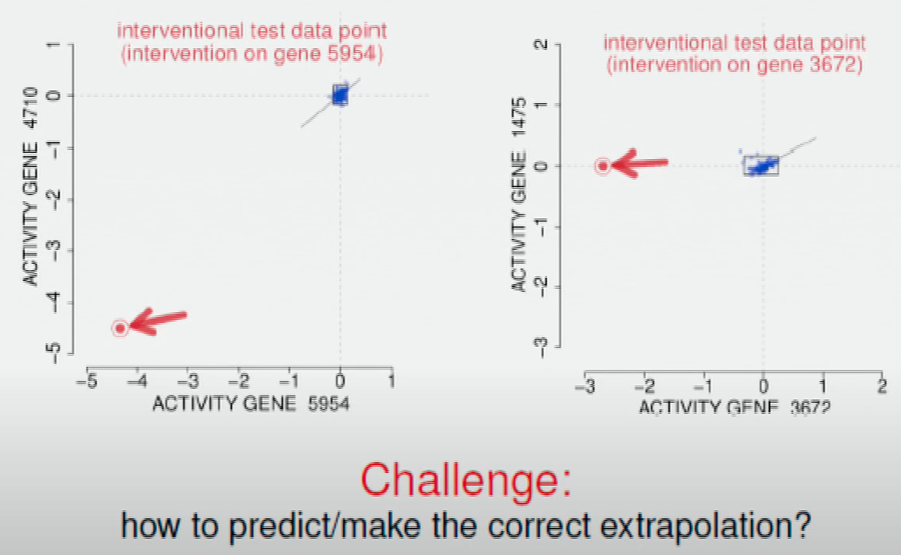
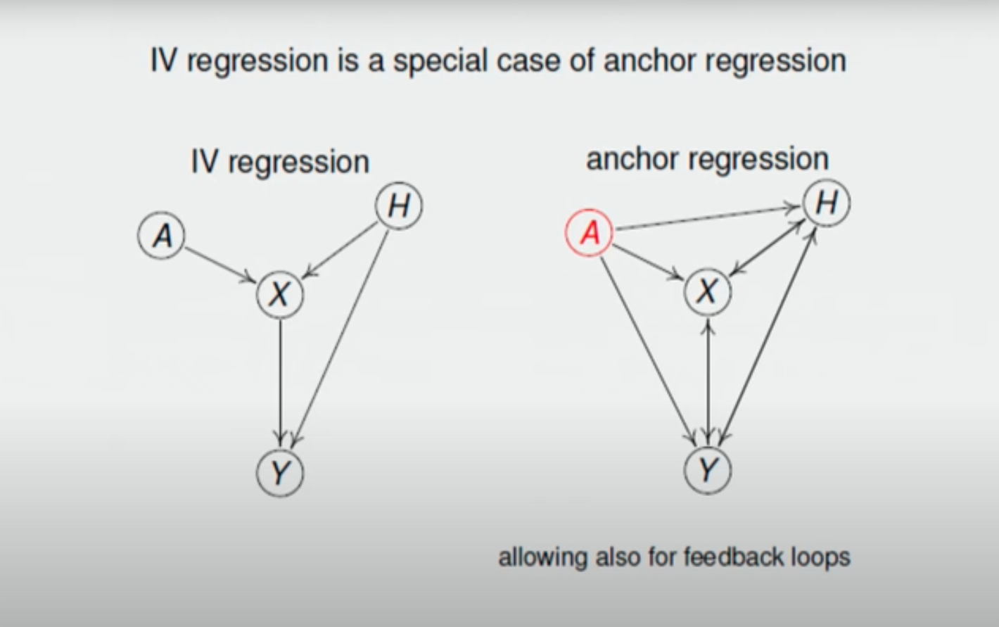

# Day 1

$U$ is a set of latent variables, $V$ is a set of observed variables. If we have a distribution $P(U)$ over latent variables, and a deterministic function $F$ from $U$ to $V$ such that $f_i : U \cup \{X_1, \dots X_{i-1}\} \to X_i$, then we have a distribution $P(V)$.

$$P(V) = \sum_{U} \prod_{i} P(X_i | \mathrm{parents}(X_i)) P(U)$$

Not an intervention on $X$:
$$P (Y | X) = \sum_{Z, U} P(Y, U, Z | X) = \sum_{Z, U} P(Y | U, Z, X) P(U, Z | X)$$
$$= \sum_{Z, U} P(Y | U, Z) P(Z | X) P(U | X)$$

Intervention on $X$:
$$P_x (Y) = \sum_{Z, U} P_x(Y, U, Z) = \sum_{Z, U} P(Y | U, Z) P(U) P (Z | X)$$
$$= \sum_{Z, U} P(Y , U | Z) P(Z | X) = \sum_{Z, U} P(U | Y, Z) P(Y | Z) P(Z | X) = \sum_Z P(Y | Z) P(Z | X)$$

Intervention on $X$ without $Z$:
$$P_x (Y) = \sum_{U} P_x(Y, U) = \sum_{U} P (Y | U, X) P(U)$$

## Invariance, Causality and Novel Robustness

[Link to talk](https://www.youtube.com/watch?v=FNnHupgrILY)

Distributionally robust optimisation is the learning of a parameter that maximises the likelihood of the data under a range of ground-truth distributions $\mathcal{P}$ instead of only one.

$$\hat{\theta} = \argmax_\theta \min_{P \in \mathcal{P}} \mathbb{E}_{P(X)}[Q_\theta (X)]$$

Typically the family of distributions $\mathcal{P}$ comprise distributions with a smaller Wasserstein distance to the empirical distribution $\hat{P}$ than a given value $\epsilon$.

$$\mathcal{P} = \{P ~|~ \mathrm{D}_W [P || \hat{P}] \leq \epsilon\}$$

In a general sense $\mathcal{P}$ is a class of distributions that captures "interesting" directions of variation.

The central question in causality is "What would happen if I perturb the joint distribution in this way?". We want to predict the outcome of an unobserved manipulation.

> Classic example of difficulty of extrapolation. The learned $P_\theta (Y|X)$ has low likelihood when we intervene on $X$.

**Solution.** Borrow strength from other perturbations. We need some heterogeneities in the data.

**Invariance Assumption.**

$$\exist ~ S \subseteq \{1 : d\}, \theta ~ \text{such that} ~ P^{e_1}_\theta (Y|X_S) = P^{e_2}_\theta (Y | X_S), ~ \forall e_1, e_2 \in \mathcal{E}$$

Assume perturbations only act on $X$, not on $Y$.

> Q. How does this model fit with the notion of strong ignorability in the Rubin causal framework?
>
> A. If the perturbation (intervention) class is rich enough, then the set $S$ is uniquely identifiable.

**The linear model is identifiable.** $\argmin_\beta \max_{e \in \mathcal{F}} \mathbb{E}_{\mathring{P}} [(Y - \mathring{\theta}^T X)] = \mathring{\theta}$. How about when $e \in \mathcal{E}$?

## When is invariance not enough?

In the typical setting in causal inference, we want to predict $Y$ from $X$, where $X$ comprises multiple variables, some of which are causes and some of which are effects of $Y$. The idea of invariance is that we should train our predictor to select the subset of $X$, $S(X)$ that are causes, because the probability $P(Y|S(X))$ does not change if we intervene on $X$. So, the way to go is to have But there are some issues with this.
- What if $S(X)$ is very small, or has very low predictive power? Can we not use $X \setminus S(X)$ to increase likelihood while keeping robustness. This requires the anticausal setting.
- What about confounders?

[Invariant Models for Causal Transfer Learning](https://arxiv.org/pdf/1507.05333.pdf)

[Causal inference using invariant prediction: identification and confidence intervals](https://arxiv.org/pdf/1501.01332.pdf)

[Domain Adaptation under Target and Conditional Shift](https://proceedings.mlr.press/v28/zhang13d.pdf)

## Sometimes the causal predictor is not the best predictor

1. **Goal.** What would the target variable be if we intervene on the source variable?
2. **Causal predictor.** The current approach is to use the causal predictor, which is robust to interventions. You find the causal predictor through invariance.
3. **Problem.** Sometimes the causal predictor is too conservative. Very few features are pure causes of the target. 
4. **My solution.** Instrumental variable.
5. **Other work.** Anchor variable.

## Presentation

Goal. What would the target variable $Y$ be if we intervened on $X$?

We want to predict the happiness of the country if we take various social or economic measures: raise taxes, plant flowers, build more factories.

Problem. Sometimes the maximum likelihood estimator doesn't predict what happens under an intervention.

If we plot the relationship between tax level and country, we discover