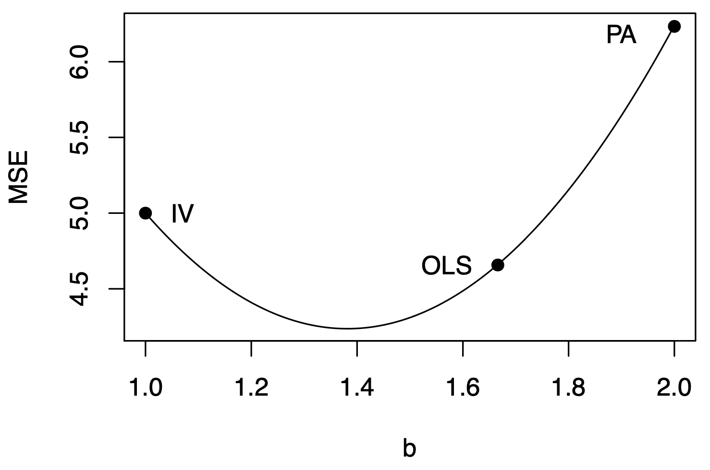
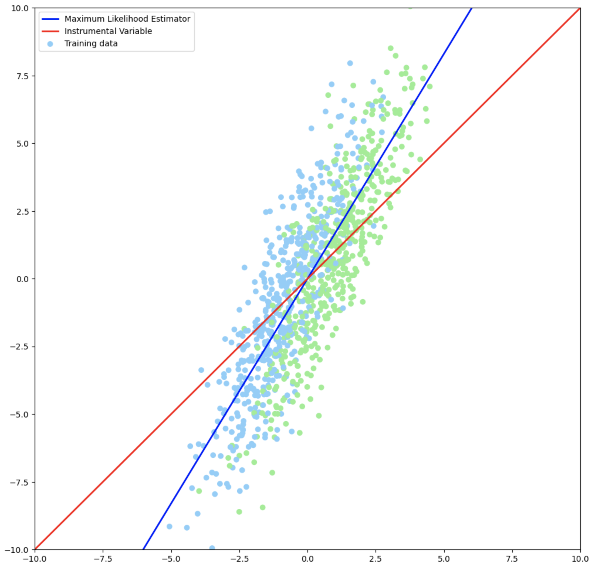
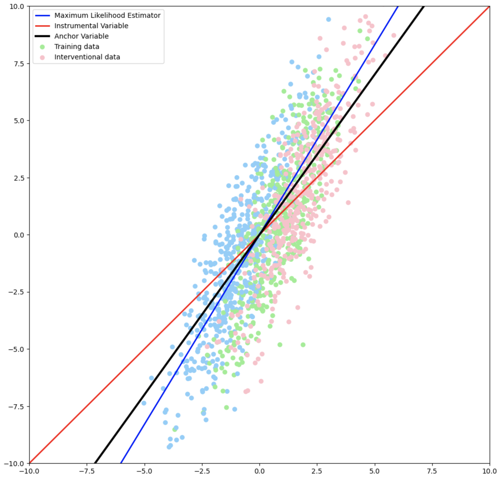

# Causal Predictor: The Best Predictor?

Let's understand together how Causal Invariance works, and whether we can find something better?

## Overview

What is the impact on the target $Y$ would be if we intervened on the covariates $X$?

> The optimal value for the regression parameter $b$ cannot be recovered by either MLE or the Causal Estimator.

- Formulate the task and define a model.
- Show an example where the Maximum Likelihood Estimator fails.
- The causal predictor fixes that failure case.
- Show a case where the best predictor is neither.
- What to do? Anchor regression is one candidate.

## Robust predictions

We want to predict what would happen to $Y$ if we intervened on a subset of $X$. $X$ comprises a set of variables $\{X_1, \dots X_K\}$, some might be direct causes, some might be effects, and some might be confounded.

**Example.** We want to predict the happiness of our country after intervening on different social or economical phenomena.

**Goal.** Causally invariant parameter is $\hat{\theta} = \argmax_\theta \min_{\mathring{P} \in \mathcal{P}(\cdot | \mathrm{do}(X))} \mathbb{E}_{\mathring{P}_{X, Y}} [P_\theta (Y | X)]$

## Simpson's paradox

The maximum likelihood predictor isn't always causally invariant.

We plot happiness of countries against tax level. We see a positive correlation between tax level and happiness. 

But obviously rasing taxes makes no one happy. The MLE predicts the opposite trend of the underlying one. The problem is that there is a hidden confounder, namely the economic development of the country.

## Instrumental Variable Regression

Find an exogenous variable which causes the covariate, but doesn't affect the target (conditioned on the covariate).

Is the government fiscally bearish or fiscally bullysh. Fiscally bearish governments will impose higher taxes than necessary. We model a population-level effect.

$$P_\theta (Y | X) = M^T (Y - X^Tb)^2$$

We treat the two categories as 2 interventional distributions, and maximise the likelihood of the worst distribution. The line that comes out is almost at 90 degrees to the MLE, and is close to the correct one.

## When the best predictor is neither

We plot the happiness of the country as a function of how often people go to a museum. The instrumental variable is the number of museums.

> The instrumental variable produces a more conservative estimate than the MLE. Too conservative?

> The optimal value for the regression parameter $b$ cannot be recovered by either MLE or the Causal Estimator.

## Anchor variable regression

> Anchor regression has a higher likelihood on the interventional distribution than the instrumental variable.

