# Future of AI presentation - Heterogeneous data: problem or opportunity?

- Focus on applications.
- Should use my generative art to spice up the presentation.

## Can we trust deep learning to correctly diagnose diseases?

> Why is this problematic? What do we expect to happen in radiology? Start with image of an X-Ray to set expectations.
> I'll start with an anecdote of where deep learning fails. We want AI to diagnose pneumonia.

[Radiological AI trained on data pooled from multiple hospitals does not generalise to data from a new hospital.](https://www.gwern.net/docs/www/arxiv.org/0a1e273df9ea6cd52397158f0d55af14a498fce9.pdf)

A 2018 paper looked at the generalisation capability of deep learning models which classify diseases based on X-rays. The models performed very well on 

The setup was simple. They pooled X-ray images from multiple hospitals into a training set for their model, and tested on data from a held-out hospital. 

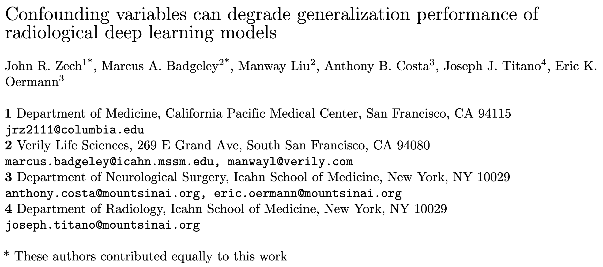

It revealed that although state-of-the-art models were achieving high accuracy in predicting diseases on the training set, the accuracy on the testing set was significantly lower. We're talking from 73% down to 24%. Why?

> Don't need table

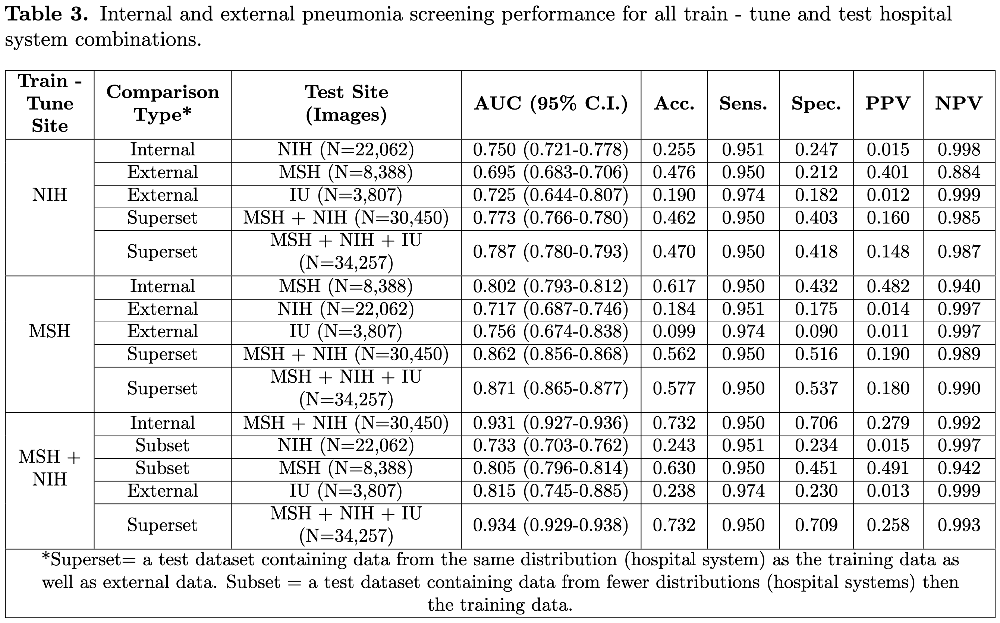

The first sign came when the authors analysed the regions to which the network was paying attention when it tried to classify the image. Take a look at these X-Rays of suspected pneumonia pacients. The bright red area shows that the model is paying disproportionate attention to the region around the patient's left shoulder.

It turns out that the reason for this is that radiologists at this particular hospital's pneumology section were putting metal tokens on the patient's shoulders in order to correctly frame the X-Ray. However, it seems that the network is using this token as a proxy for the presence of pneumonia instead of looking at the actual lungs. And it almost makes sense: a pacient in the pneumology section is much more likely to have pneumonia than a pacient in the orthopedic section.

> Laugh pause

Indeed, when the authors looked at the internal layers of the networks, they found that they could be used to identify the hospital in which the X-ray was taken, and even the department within the hospital, with an average of 99.5% accuracy.

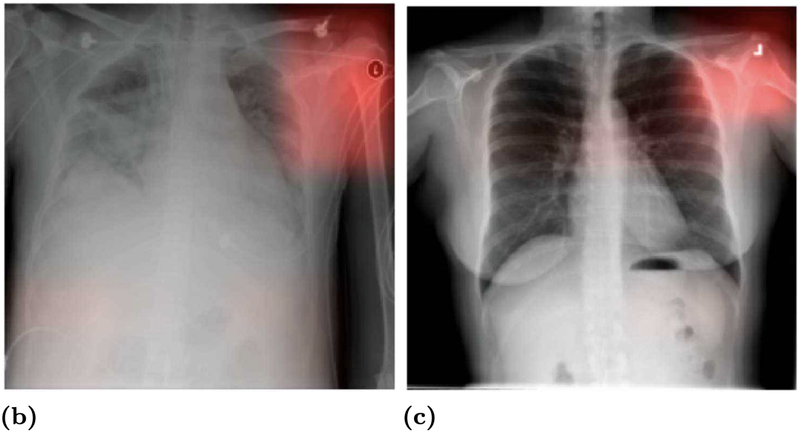

This is obviously bad, and it turns out that this problem happens often when data is coming from different environments. We call this heterogeneous data. But how should we deal with it?

## What will we talk about?

I will start by providing an overview of how machine learning usually works, and what assumptions are embedded into the techniques that produce very impressive results nowadays. 

We'll then look at what problems arise when these assumptions clash with the reality of heterogenous data (data coming from different environments), and what we can do to mitigate these limitations. 

I want to go further.

Can we use heterogeneity to give our deep learning models new abilities? (answer is yes)

As a bonus treat, at the end of the talk I will show you how to use AI to generate paintings like these. I've created these for an art competition at my College last year (and won it).

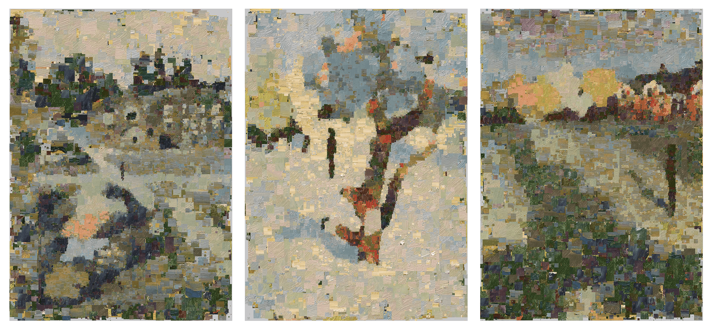

So let's dive in.

## How does machine learning usually work?

The default machine learning setup is that you want to train a network to predict a target variable given a set of input variables, called covariates.

> Paragraph too hard. Give an example.
> What image on the slide?
> Give an example of i.i.d., like the cow-camel one where.

The assumption that underpins this is that the pairs of inputs-targets in the training data are independent and identically distributed among themselves and with respect to the testing data. This basically means that we assume the same function maps input to output for every single datapoint.

This allows us to train the same function for all the data and expect it to work just as well on the testing data. And many times this is the case. Many of the incredible results that deep learning has achieved lately correspond to this assumption.

From the classification of ImageNet, which spurred the "deep learning revolution".

To the hottest thing nowadays, text-conditioned diffusion models, like DALL-E. Even though they are very complex models, they still learn in the same way, training a network to map input description to a target image.

## When does this fail?

> Continue example here

As we've seen at the beginning of the talk, however, this doesn't always work. The data wasn't i.i.d., because the images from the pneumology department were qualitatively different from the images in the rest of the dataset.

We say that the medical department is a confounder variable for the relationship between the input (image) and the target (disease).

## What can we do about it?

The problem of confounding has been studied extensively in statistics, but the solutions don't neatly apply to high-dimensional data like images or complex models like deep learning.

Group disentanglement is the approach that I study in my PhD in order to solve this problem. Basically, instead of learning one representation per datapoint, we learn two. One for the instance and one for the group as a whole.

> Map the image to the example

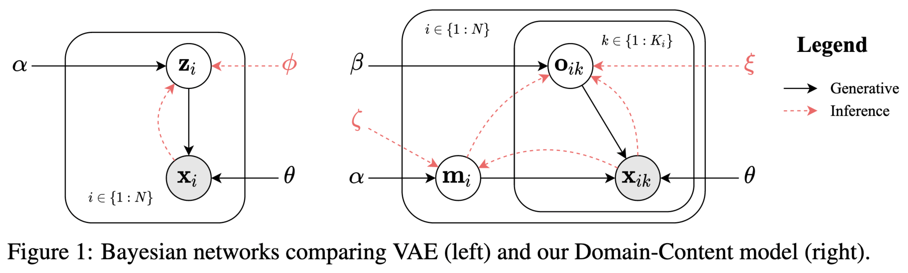

## What opportunities does this open up?

> Go directly to example.

Group disentanglement enables deep learning models to perform new useful tasks because it can make instance-level predictions by looking at group-level features. 

### Understanding ambiguous data

Disambiguation is the ability to correctly ascertain the features of a datapoint that could correspond to different combinations of features. 

For example, disambiguation enables us to infer the shape of a 3D object by looking at 2D projections of the object.

Looking at the data, it's obvious that we can only solve this task with a model that takes as input all projections at the same time. A traditional deep network will fail because  

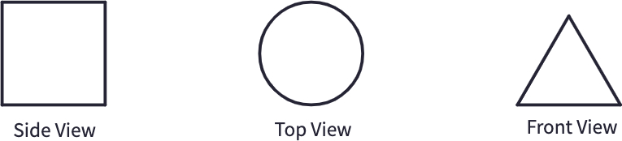

This is an example of what our network can achieve. The network receives as input 3 views of an object and has to generate 8 different views, showing that it has understood the shape of the object. We've presented this results in a 2021 paper [Domain-Content Disentanglement](https://arxiv.org/pdf/2202.07285.pdf).

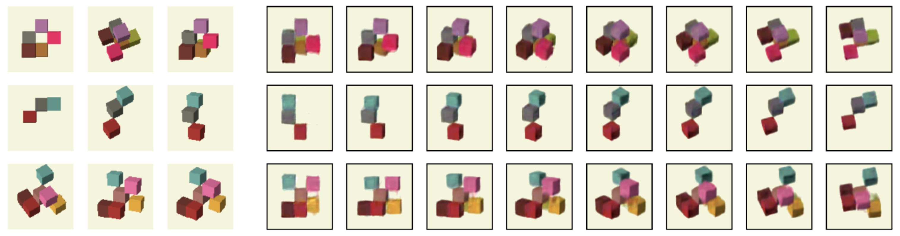

> Give real world example: autonomous driving, 3D polyp reconstruction.

## Translation

Translation is the task of generating the equivalent in group B of a given datapoint in group A. This is usually achieved by modifying the group features while keeping the instance features fixed, and then generating the result.

This is a popular application of group-disentanglement. Here is an example of a paper from Nvidia ([COCO-FUNIT](https://nvlabs.github.io/COCO-FUNIT/)) where the appearance of one bird is combined with the position of another.

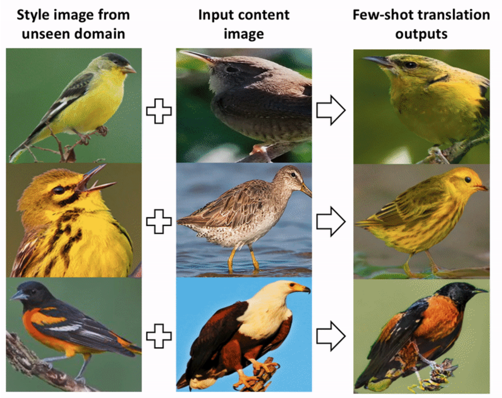

Translation is not used only for pretty images. There are many applications for counterfactual predictions, especially in medicine and economics. 

Here is a fun example from counterfactual history from Harvard. It predicts what would have happened to the United States state capacity had they not implemented the homestead act, which encouraged people to settle on the western frontier of the US ([State-Building through Public Land Disposal?](https://arxiv.org/pdf/1903.08028.pdf)).

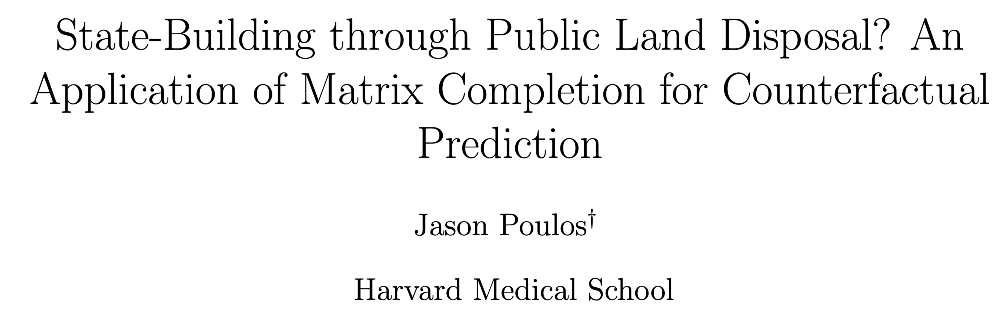

As promised, I will show you how I created those paintings at the beginning.

I programmed a particular kind of translation model where the image itself is a group, a group of patches. I train it to reconstruct the "Shape" image by re-arranging patches from the "Appearance" image. This creates a mosaic-like texture and some interesting artifacts.

I call this the "San Marco" model because famously the the Venetian mosaics in San Marco cathedral were stolen from Constantinople. You can find it on GitHub ([github/dan-andrei-iliescu/ai-painter](https://github.com/Dan-Andrei-Iliescu/ai-painting)).

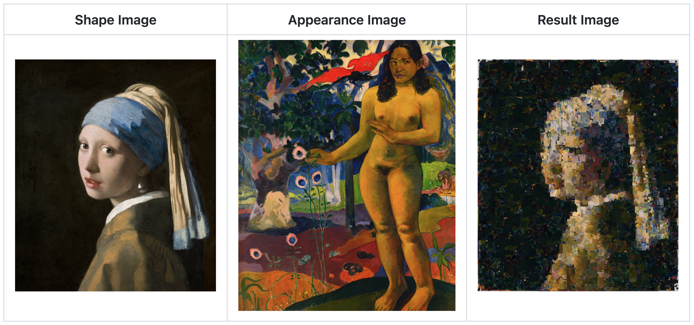

In our case, I made digital paintings of the three views of St Edmund's College (the College where I live in Cambridge). Then I took a picture of a section of an oil painting with large marks. Combining them together, I produced the final paintings.

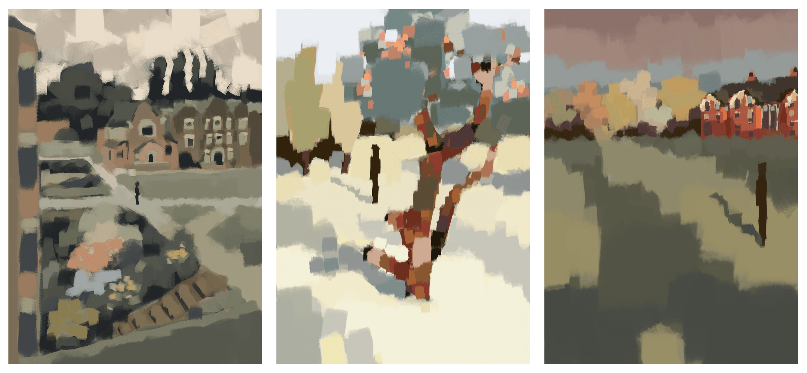
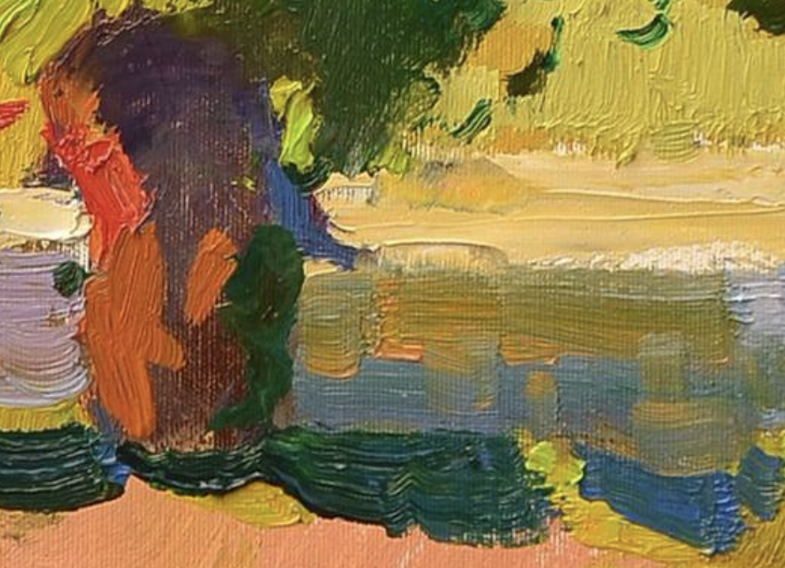
