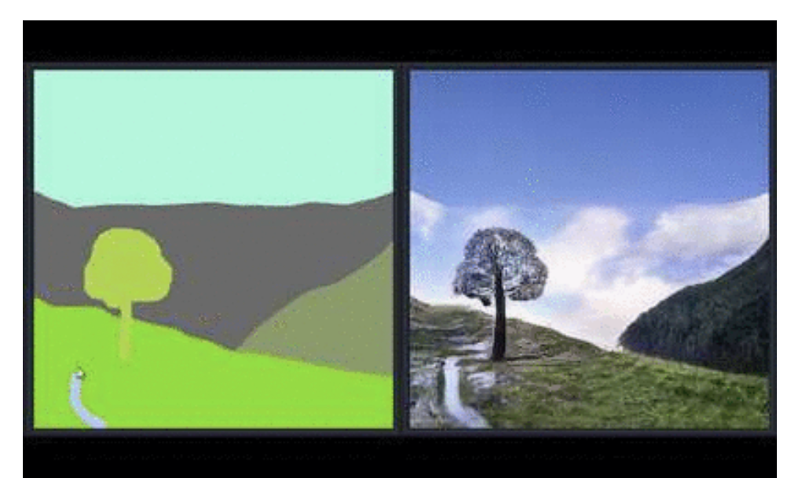
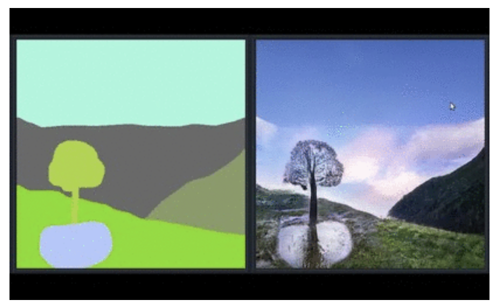

# 2022-02-17

I am implementing a new model that does semantic manipulation of images using group instance disentanglement. Semantic manipulation is the task of changing the content of an image at a specific location while preserving the overall style.

|  |  |
| --------------------------- | --------------------------- |
> Example of semantic manipulation. The puddle underneath the tree was generated by drawing a puddle on the semantic map (left) and then generating the associated image (right).

I propose the following generative model for images that enables semantic manipulation by editing a latent variable. This is the likelihood of the $n$-th image.

$$p(\mathbf{x}_n) = \int_{s_n, \mathbf{c}_{n}} p(s_n) \prod_{k=1}^K p(x_{nk} | s_n, c_{nk}) p(c_{nk}) ds_n dc_{nk}$$

$$c_{nk} \sim \mathrm{Cat}(\pi), ~ s_n \sim \mathcal{N} (\mu, \sigma)$$