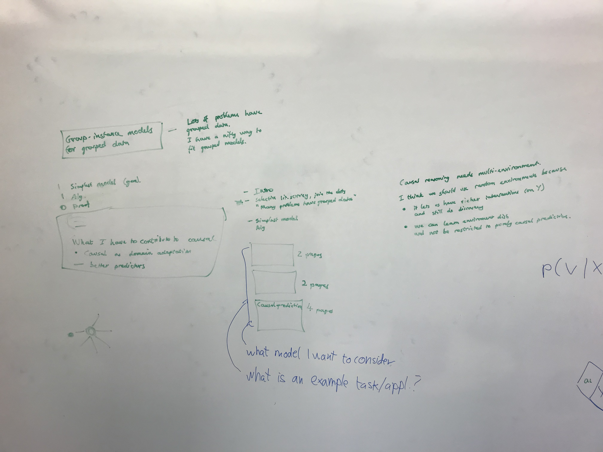
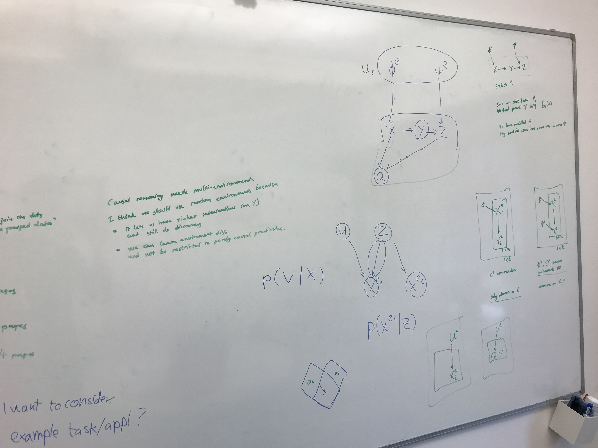

# Week of 10 October

## Meeting with Damon

|  |  |
| --------------------------- | --------------------------- |

- **Modelling random environments.** This allows us to deal with new environments at test-time. Can also model interventions on $Y$. Damon had a good example of this.
- **Predicting using non-causal variables.** When we don't know the environment, the best thing to do is to predict $Y$ using only the features that are invariant causal predictors. But when we model the environment, we can sometimes use some non-causal predictors as well.
- **Proof.** I have a generative model, a way to train it, but I don't have a proof that it's optimal. This should be a proof showing that, under certain assumptions, the ground-truth model is identifiable (our model will learn the true model).

#### Draft structure

1. **Introduction.** Generative models for grouped data. Lots of problems have grouped data, and I have a nifty trick to fit them.
2. **Literature Review.** Many problems have grouped data, so join the dots. Carve out the space in the literature that I am addressing.
3. **Algebra.** Start with simplest model.
4. **Tasks.** 3 examples.
   1. What is the example task/application?
   2. What model do I want to consider? 

### Preparation

I want to agree together on a schedule for the rest of the PhD. I also want to discuss what else is necessary to finish the PhD.

The problem I want to address is how to learn with data from different environments.

I want to address cases where the generative model is not invertible.
There is a proof showing that a model mapping a single input to a single output is identifiable if you have access to multiple interventions on that image (to which the target is invariant) as long as the generative model is invertible.

What is unique about my approach?

I deal with the case where the generative process is not invertible. I am introducing a way to build representation networks for data coming from multiple environments. In broad strokes

#### What problems arise with data from multiple environments?

Solves problems in regression.
- ambiguous observations
- generalisation to new environments
- ignoring confounders

Enables controllable generation. How to create a new sample from the data distribution that has certain properties?
- Image editing, image translation, image inpainting, novel-view synthesis,  speech control.
- Collaborative filtering
- Counterfactual time-series.

#### What I have done so far

- The problem is how to control speech using as little input from the user as possible. A method for filling in missing values in multivariate time-series by treating each time-series as a different environment and each sample as a datapoint. How do you distinguish between datapoints? Use a positional embedding. How is this different from BERT?

#### Suggested schedule

- Submit dissertation - 31 May 2023
- Finish group-disentanglement experiments - 5 Nov 2022
- Draft of dissertation - 25 Nov 2022
- Submit group-disentanglement for control through missing values - 27 Jan 2023

## Observations

With every piece of research, I must ask myself not only if the solution I find agrees with my theory, but also if my theory is the most likely theory producing that solution.