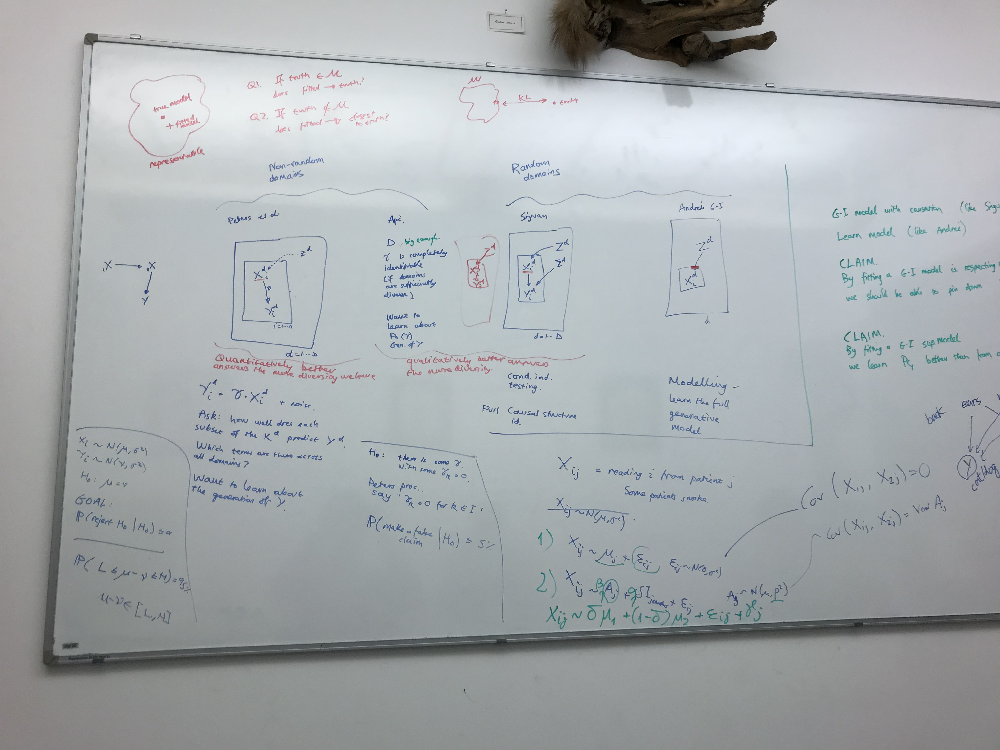
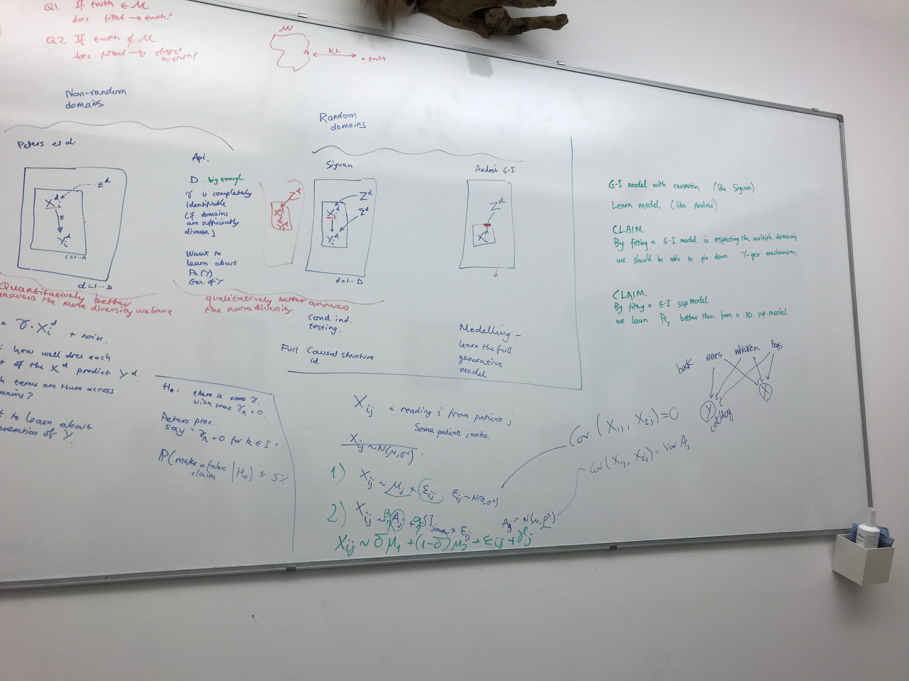

# Week of 4 December 2022

## Thesis draft

**Title:** Groups are random variables

- I am studying the problem of learning from different environments. People often treat different environments as a problem. But I want to show that they can be useful.
- The naive approach to learn to predict $Y$ from $X$ is to train $P(Y|X)$ to maximise the likelihood on the training set, by pooling together all the data from different environments. The more sophisticated approach is to train $P(Y|X)$ to maximise its performance on the worst performing environment. Under some assumptions, this is equivalent to selecting the features from $X$ that causally generate $Y$. However, in some environments, some additional features could be useful for predicting the target, even if we know that they are not true causes.
- A true cause predicts a target with the same level of accuracy regardless of environment. We cannot completely prove that a feature is a true cause, but we can sometimes show that a particular feature is not a true cause.
- The problem of generalisation can be reframed as a problem of multiple environments, where the training and holdout sets are poolings of different sets of environments.
- Why is a generative model for groups useful? There are 2 other options other than using a group-level random variable. The first option is to ignore the group completely and aggregate the data. The second option is to have a group-level parameter.
- I am selling the story that many problems in machine learning can be seen from the perspective of grouped data. In particular, I am pushing the idea that a group-level random variable is a useful instrument for solving these problems. 
  - In one instance, I show that the simply training a generative model for grouped data is a useful instrument for translating between groups, which is useful for a range of tasks. My contributions in this area include demonstrating that conditioning the instance encoder on the learned group representation is essential for dealing with conditional shift. This allows me to prove an identifiability theorem for my model with fewer assumptions than have been shown in previous models. Another contribution is that I am using a novel regularisation procedure inspired by the variational information bottleneck theory.
  - In another instance, I show that group techniques can not only help deal with data from different environments, but also for the generalisation from train set to test set, by splitting the train set into groups. Here, I show that conditioning on a learned group-level representation. This is related to the issue in causality of learning predictors that are invariant to interventions on the predictor variable. The predictors we learn are not invariant to any 
- What are the main contributions of my PhD?
  - I prove an identifiability theorem for the inference model of a group generative model. Why do we need this? Linear mixed-effects models can be trained directly using expectation maximisation, but more complex generative models for grouped data require an amortised inference procedure. Such a procedure already exists when we assume that the generative model is invertible. We extend it to the case when its not invertible. We show that this case is relevant when there is conditional shift in the dataset, an important phenomenon in prediction.
  - I show that predicting $Y$ from $X$ can benefit from conditioning on a group-level latent variable.
- Using the wisdom of mixed-effects models to solve problems in the realm of highly non-linear 
- Literature review
  - Multiple instance learning aims to aggregate information from multiple observations in order to make a prediction about the group. We are using the paradigm of multiple instance learning in order to perform inference on group-level random variables.
  - Federated learning studies the challenges 
  - Representation learning proves theorems

## Meeting Damon and Api

|  |  |
| --------------------------- | --------------------------- |

- **What are mixed-effects models good for?** $X_{ij}$ is reading $i$ from patient $j$. The mixed model has a non-zero covariance between one patient's readings. It also allows to infer $B_j$ at test time for an unseen environment. We treat $\alpha, \beta, \gamma, \mu$ as parameters set after training, and $A, B$ as random variables that can be inferred from the holdout set.
  - The simple model is $X_{ij} = \alpha A_{ij} + \beta$.
  - The non-random group model is $X_{ij} = \alpha A_{ij} + \mu_j + \beta$.
  - The mixed model is $X_{ij} = \alpha A_{ij} + \gamma B_j + \beta$.
- **There are 2 kinds of mathematical claims.** *One important thing to realise is that achieving maximum likelihood on the training set does not guarantee maximum likelihood on the holdout set, which is what we are trying to achieve.*
  - One is that, if we assume that the ground-truth generative model belongs to the class of models that we are considering, then our fitting procedure will find the ground-truth. 
  - Another is that, if the ground-truth model is not in our family, does our fitting procedure produce the closest model to the ground-truth?
- **Why would we want to allow interventions on $Y$, not just on $X$?**
  - Let's say I want to train a tree classifier using images of leaves gathered by me. The images are $X$ and the tree species are $Y$. On different days you take photos of different trees because you go to different places. The lighting and weather is also different, which means that the colours of the trees would appear differently.
  - Class definition change. Let's say that in different environments the way the classes are labelled differs. For example, a "severe" fever could be any temperature above 38C in one hospital or above 39C in another. This is called "concept shift" ([Moreno2010Unifying](https://rtg.cis.upenn.edu/cis700-2019/papers/dataset-shift/dataset-shift-terminology.pdf)).