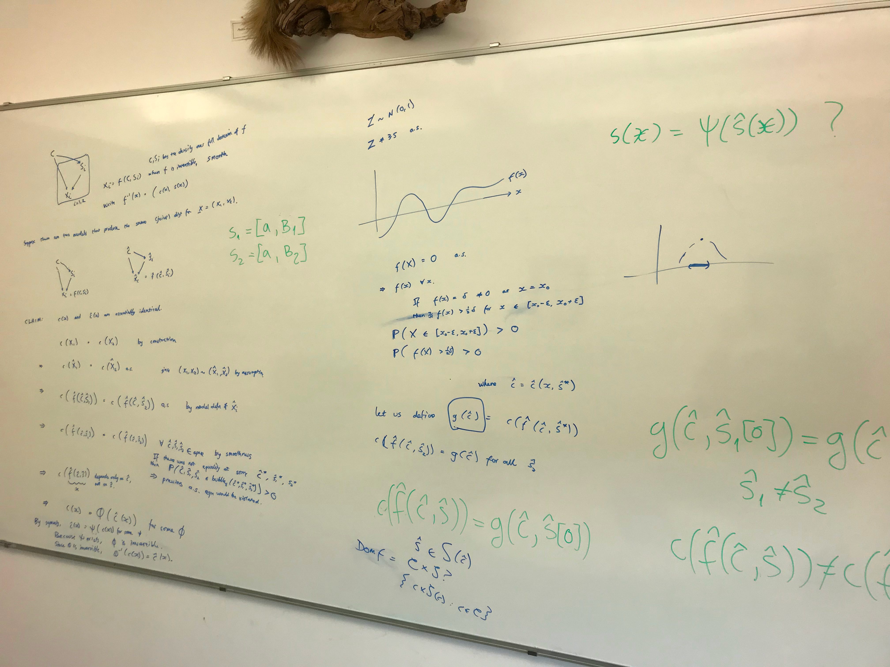

# Week of 6 February 2023

One important thing that I learned during the PhD is that sometimes it's better to say something specific but wrong instead of something vague but correct. So when writing a paper it is the author's responsibility to come up with an application problem for their idea, even though future generations might apply the same idea to a completely different problem. Somehow, giving a concrete proposal gives the interlocutor ideas for counter-proposals, it starts a conversation.

But this is not always true. When asking a personal question, it is better to ask an open question that allows the interlocutor to reveal their own framing, rather than propose an answer and ask them to say yes or no.

What are cases where group-instance disentanglement is useful?
- Personalised time-series predictions. If you have multiple time-series, you want to predict what this time-series will do by leveraging the other series in the dataset.
- Group-level predictions. This is multiple instance learning, what I do at Papercup. The advantage of this approach is that the instances don't need to be the same type of data, they can be different kinds of features that we can aggregate. This is also what predictors do when they try to estimate the content under different data augmentations.
- Learning from different cultures. Learning from a single culture is subject to group-level noise. Learning from data collected from different cultures is subject to simplification, reduction to the lowest common denominator. Only by being group-aware can the algorithm predict accurately.
  - What are some examples of this? When constantly interacting with people of different cultures, but not being educated about which culture has which expectations, the safest approach is to behave in a neutral way. But with the benefit of knowledge about which behaviours are associated with which others enables you to decide which behaviour is appropriate to which situation.

  Let's imagine a situation. The observations are the level of politeness and we want to predict hostility. People behave differently in different cultures, and the cultures are the groups. Then, in order to accurately predict hostility, you need to normalise the level of politeness by the culture.

  But what if hostility differs by culture? You can't normalise per culture just by using the distribution of politeness, you also need a few labels.

## Meeting Damon

Talk a bit about how the Papercup internship went.

### How to make an identifiability proof?

This is from the paper on style-content disentanglement.

**Theorem 4.2.** If we have two generative models each with the properties that 1) the generator function is smooth and invertible, 2) the latent density is smooth and non-zero almost everywhere, 3) for any style variable there is at least one intervention that affects that style variable, and 4) the content variables are never affected by any intervention, and if the two generative models have the same data density (maximum likelihood), then the two content variables are block-identified.

**Proof.** The proof comprises 2 steps:
1. Use that the generator is invertible and that the likelihoods are matched to show that the two latents are connected by a smooth invertible mapping and, more precisely, if 2 datapoints have the same content variable in one model, they will have the same content variable in the other model as well.

Comments.
- The theorem also assumes that the number of content and style variables in both models is the same, I don't see why this is relevant.
- Apparently, this theorem does not assume that the style and content variables are independent, just that each group has the same content variable.
- Does it only show block-identifiability for the content variable? This makes sense for the framing of data augmentation, but in fair / personalised representations, we are more interested in the identification of the style variable.

But we are interested in cases where there the generative function isn't an invertible mapping, as multiple combinations of style and content variables can generate the same datapoint.

What kind of identification theorem can we hope for? That the mutual information between the style of model A and the content of model B is 0. The mutual information between the two content variables should be the entropy of either content variable. My research question is actually, what set of assumptions do we need to prove something like this? For example, that style and content are independent.

### Damon's advice 

Find cases where you can't draw a function from the generated style variable to the true style variable.

Maybe there is some equivalence class

## Omer's talk

Because average is low, it never crosses 35 degrees.

GCM never covers the lower bound of the ERA.

Extreme events are more frequent that the simulation would predict.

Reporting of heatwaves are using climate models, so they are significantly underreporting heatwaves.

1-D bias correction techniques are ridiculous, one example is MORA's version.

Relationship between ML and bias correction. Mora's method is actually training a probabilistic model with MSE.

Reject the climate paradigm. If we can use one specific probabilistic model, we can use other probabilistic models.

## Hackathon

We have missing data (temperature readings at different locations but different times). How best to predict it? Some temperature readings are taken from the same location, same time, or same simulation. What we want is to infer the temperature reading for a new location and a new time. Therefore time and location should be random variables. The number of simulations is fixed. However, we can treat them as random variables if we want to measure the strength of relationship between them.

### Why use a group?

The data naturally comes from different environments, and we want to generalise to a new environment.

Why model the groups as random variables?

Groups have advantages over using conditioning labels. The random variables allow us to measure the mutual information between environments. The random variables allow us to generate data / predict from a new environment.

