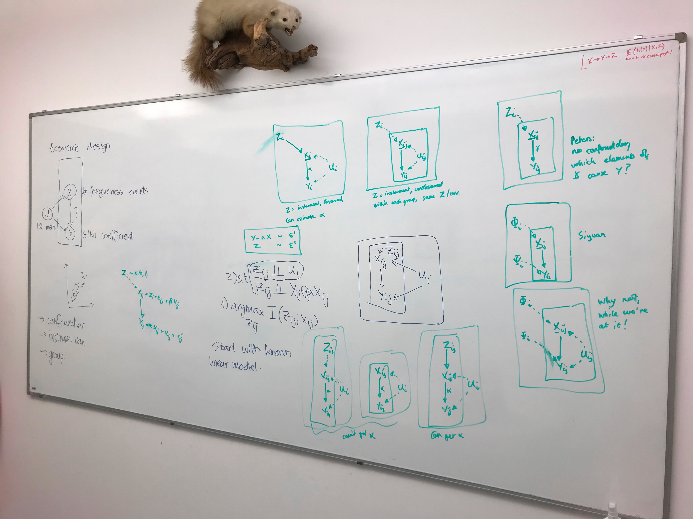

# Week of 20 February 2023

## Meeting Damon

We have three situations of group-instrument-confounder relationship. The instrument is the group, the confounder is the group, or there is no group. Start with a simple linear model of each of them and try to see what Damon's "defective likelihood" will learn.

So what are some examples of the 3 cases?

| No group | Confounder is Group | Instrument is Group |
| -------- | ------------------- | ------------------- |
|          |                     |                     |

## Qualcomm research fellowship

Learning instrumental variables

**Introduction, which describes the problem and current state of the art (i.e. limitations or lack of current solutions)**

There is a disconnect between the problems for which machine learning is designed and the ones on which they are applied.

The problem we are addressing is the classic machine learning task of predicting the target Y from the source X. Alternatively, it is the statistical task of estimating a parameter $\theta$ that maximises the conditional probability of $Y$ given $X$: $P_\theta(Y|X)$.

This task is frequently complicated by the presence of confounders. Confounders are phenomena that distort the relationship between source and target. They arise as random variables that cause both the source and the target.

One solution to this is finding an instrumental variable. This is a variable that causes both the source and target.

However, a major problem with this solution is that instrumental variables have to be independent of the confounder.

**Proposal, which describes the innovation idea, and what you propose to do.**

I propose to learn an instrumental variable as a latent variable that can be inferred from the environment and then used as conditioning for prediction.

I propose to treat environments as random variables whose values can be inferred and then used as conditioning 

There is a way of training the model that trains for independence instead of maximising the likelihood of the data. It trains a predictive model as a side effect of this independence.

The impact of this innovation would be that one can train a predictive model independent of confounders automatically.

There are 2 goals 

**One-year horizon, which explains the target goals for one year and preferably also includes the long-term milestones**

The question is how 

We intend to 

**Description of the student's strength and proposed contribution to the innovation for achieving the milestones. Also describe why this student is better suited for this proposal than anyone else.**

My PhD research explores the interface of generative models and causal inference. Namely I look at how concepts from causal inference help us deal with confounders in domain adaptation.

I also have experience applying deep generative models to real problems in the field of computer vision and speech science.