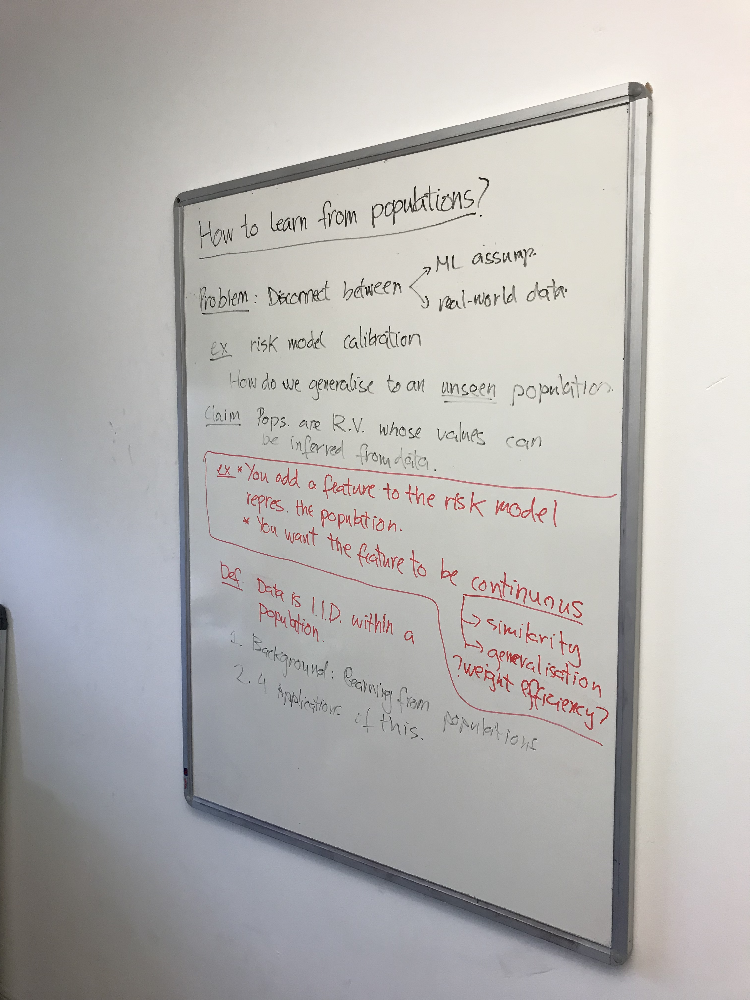
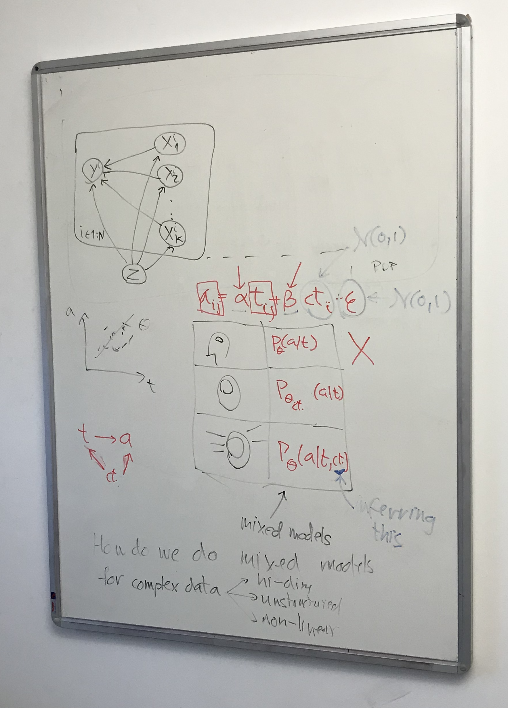

# Week of 10 April 2023

## Schonfeld

- High-problem solving, academically driven.
- Keen on academic research "nerdy".
- Clear research process, pipeline, planning.

## Damon Meeting

Instrumental variable: Z is not caused by confounder.
Inverse propensity: Z is caused by confounder.

How can we combine IPTW with time-series?