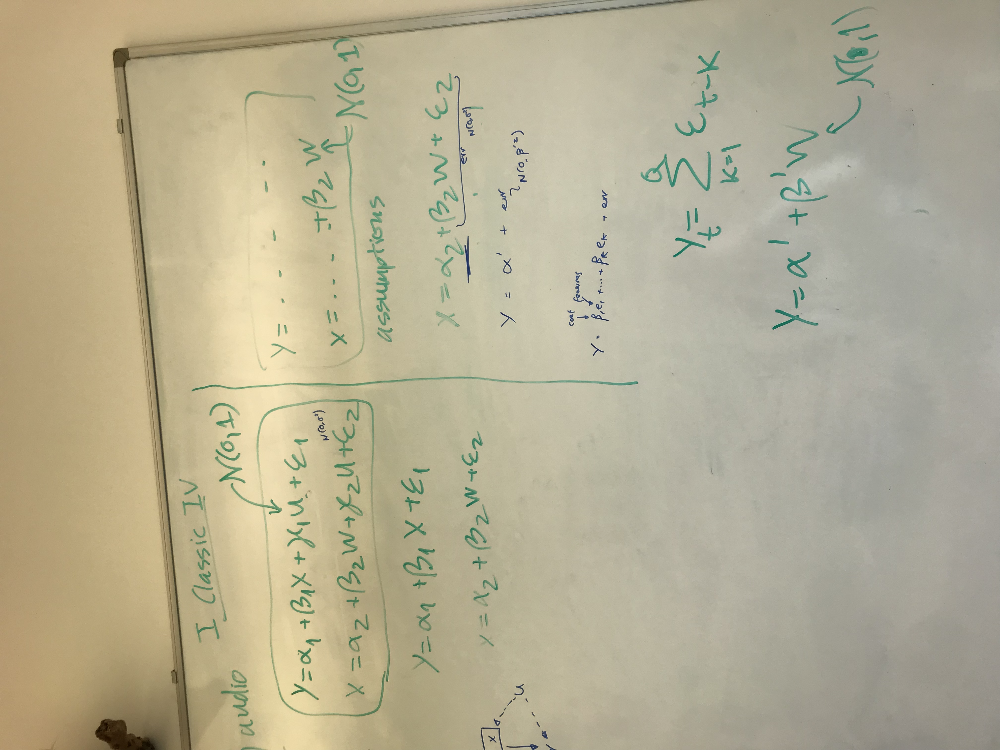
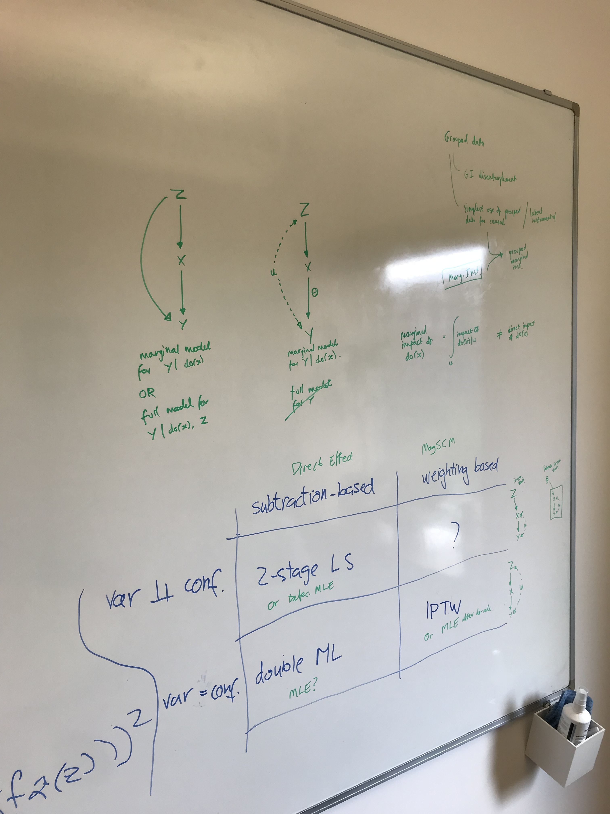
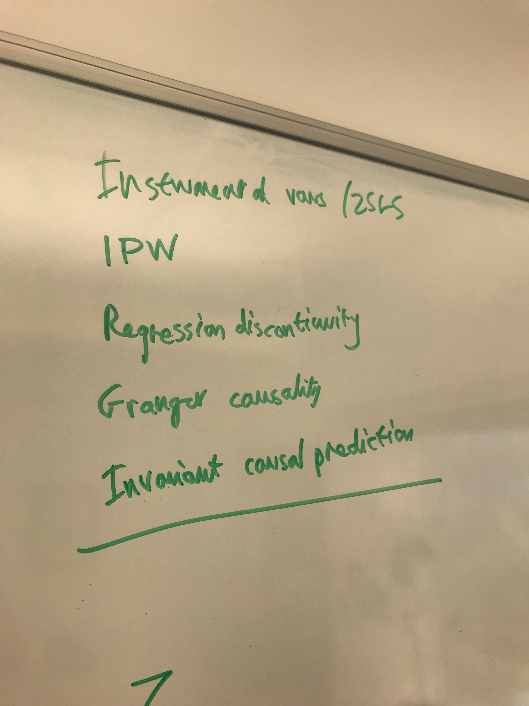
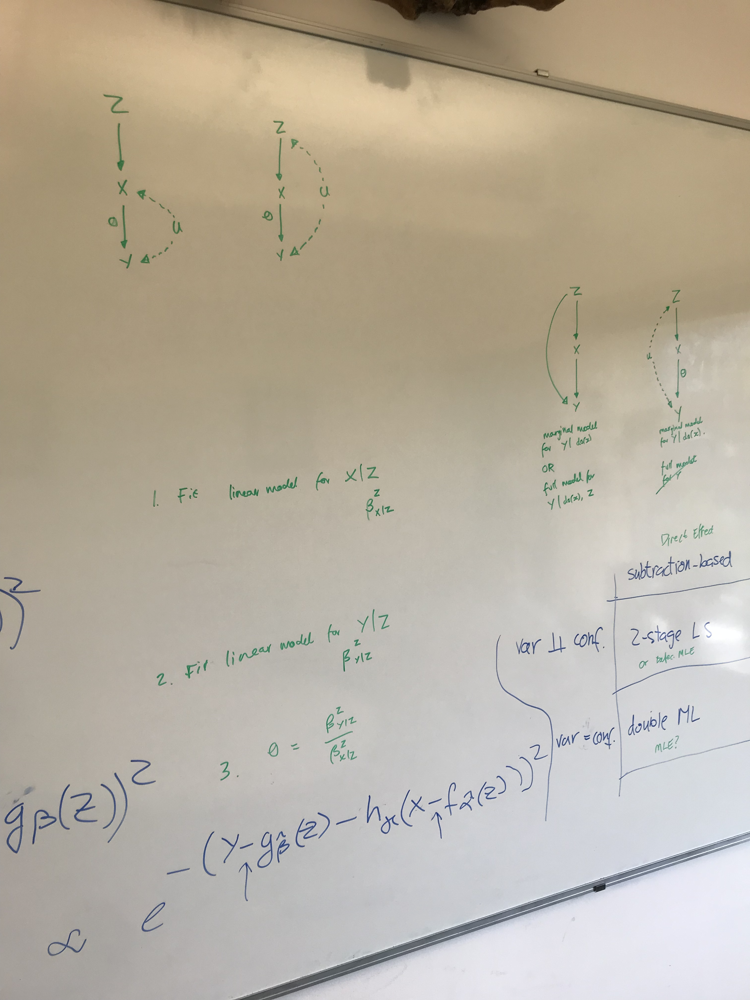

# May 2023

## Meeting Damon

### Prep

We want to infer a vector from data representing an instrumental variable. This means that the vector should maximise the mutual information from itself to the target, and minimise the mutual information with the confounder.

- What is the difference between mixed-effects models and Gaussian Processes. Gaussian Processes don't have fixed effects (but they have hyperparameters). Random effects are latent variables.
- Different cultures rather than different models.
- How ML people have tried to solve this problem? Where do I position myself?
- What precisely is the problem with Gaussian processes and nonlinear mixed-effects models. Why is it hard for them to train and infer in higher dimensions?
- How the existing communities failed to tackle the problem, and how they would if you gave them the attempt.

## Seb Hickman

- Double Machine Learning: [paper](https://arxiv.org/pdf/1608.00060.pdf)
  - Frisch-Waugh-Lovell Theorem: If you have a regression, instead of regressing Y on X, you regress Y on Z and Y on X, and then try to regress the residual of Y on the residual of X.

## Double Machine Learning

## Meeting Damon - 2023-05-18

|  |  |  |
| --------------------------- | --------------------------- | --------------------------- |

### Taxonomy of quantitative causal inference

When is the marginal effect of $do(T)$ on $Y$ different from the direct impact of $do(T)$ on $Y$. So when is $P(Y | do(X))$ different from the direct impact? I don't know what this means. Why did Damon say that the direct effect is different from the Marginal SCM?

Quantitative techniques for causal inference:
1. Instrumental vars
2. IPTW
3. Regression discontinuity
4. Granger causality
5. Invariant causal prediction
6. Group-learning

|                             | Direct effect, subtraction_based | Marginal SCM, weighting based |
| --------------------------- | -------------------------------- | ----------------------------- |
| variable $\perp$ confounder | 2-stage LS, or Defective MLE     | ?                             |
| variable  is confounder     | Double ML, is it MLE?            | IPTW or MLE with $do(T)$      |

### Defective MLE

1. Fit $\beta_1$ linear model for $X|Z$
2. Fit $\beta_2$ linear model for $Y|Z$
3. $\theta = \beta_2 / \beta_1$

