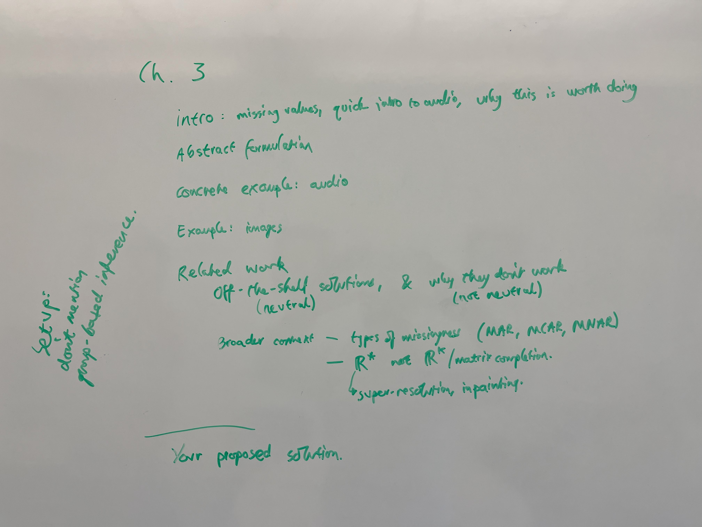
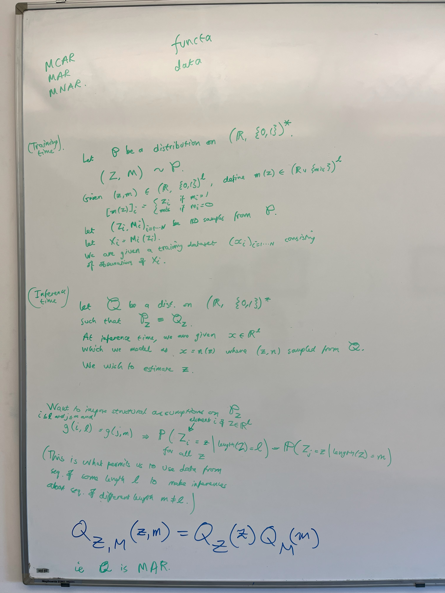
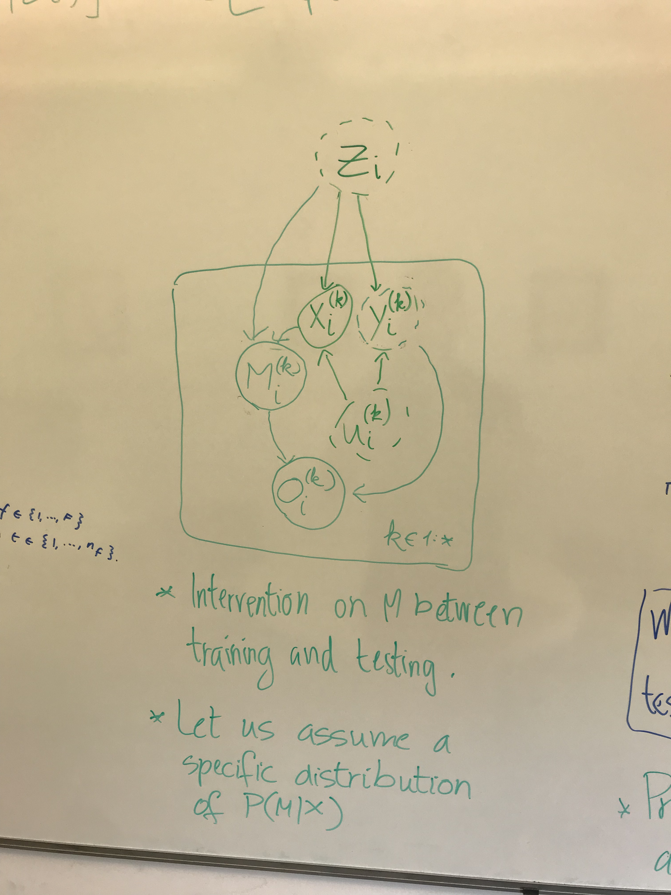
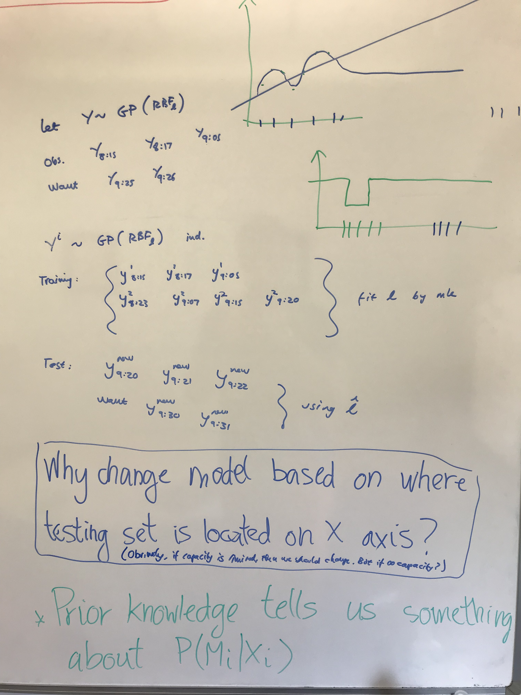
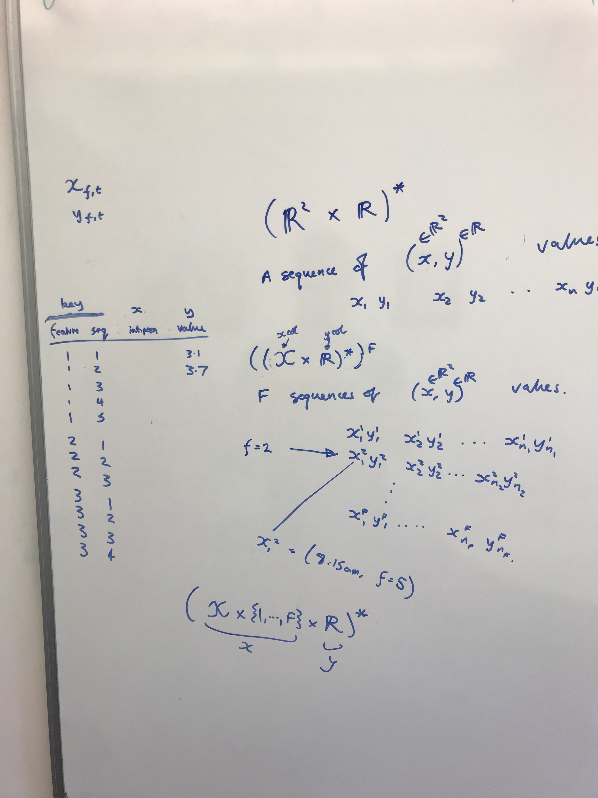
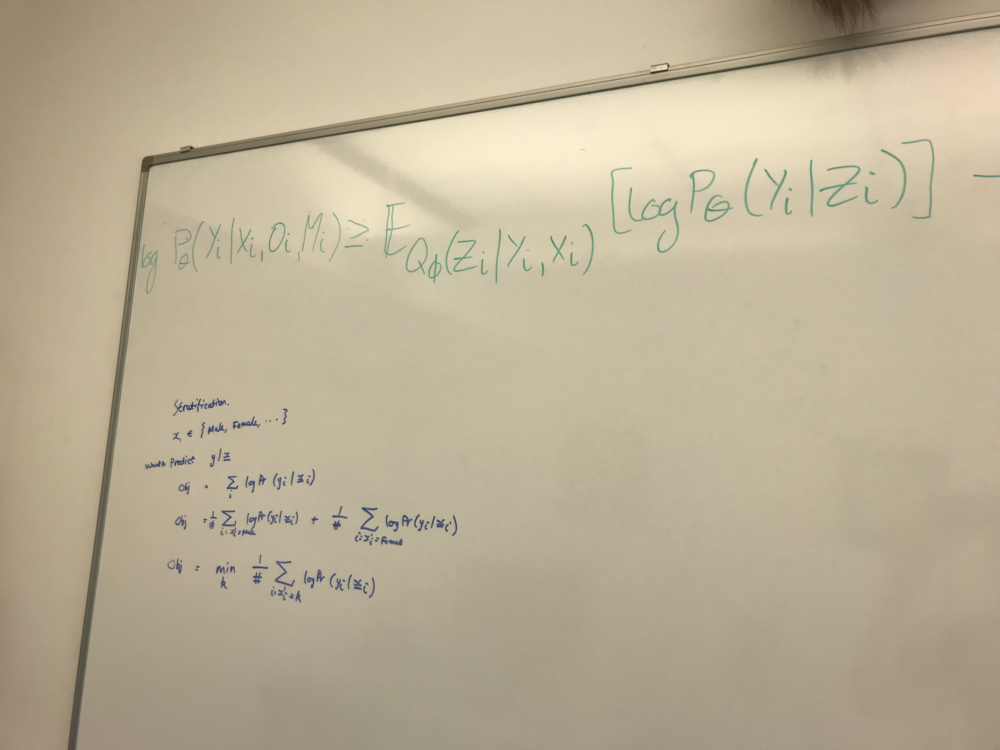

# June 2023

## Meeting Damon - 2023-06-14

New plan for chapter on missing data imputation

1. First start with the setup. Don't mention group-based inference.
   1. Introduction: missing values, quick intro to prosody control, why this is worth doing
   2. Abstract formulation
   3. Concrete example: audio
   4. Another example: images
   5. Related work
      1. Present off-the-shelf solutions in a neutral manner. Then talk about why they don't work (don't be neutral).
      2. Talk about the broader context, this lies outside the problem definition, so don't be neutral.
2. Then discuss my proposed solution.

### Problem statement

**Training.** Let $\mathbb{P}$ be a distribution on $(\mathbb{N}, \mathbb{R}^{F})^*$ with $(X, Y) \sim \mathbb{P}$. Let $\{(X_i, Y_i)\}_{i=1}^N$ be I.I.D. samples from $\mathbb{P}$. We are given a dataset $\{(x_i, y_i)\}_{i=1}^N$ of observations of $\{(X_i, Y_i)\}_{i=1}^N$.

**Testing.** Let $\mathbb{Q}$ be a distribution on $(\mathbb{N}, \mathbb{R}^{F}, \{0, 1\})^*$ with $(X, Y, M) \sim \mathbb{P}$ such that $\mathbb{P}_{X,Y} \equiv \mathbb{Q}_{X, Y}$. Let $\{(X_i, Y_i, M_i)\}_{i=1}^N$ be I.I.D. samples from $\mathbb{P}$. Let $W_i$ be a random variable such that $W_{i,k} = Y_{i,k}$ if $M_{i,k} = 1$ else $W_{i,k} = \empty$ for $k \in \{1:K_i\}$. We are given a testing dataset of $\{x_i, w_i, m_i\}_{i=1}^N$ of observations of $\{(X_i, W_i, M_i)\}_{i=1}^N$.

**Objective.** We want to learn a density function $f_\theta$ that maximises the likelihood of the testing set $\hat{\theta} = \argmax_\theta f_\theta (y_i | x_i)$.

**Assumptions.** We have to make some assumptions.

1. We assume Missing At Random (MAR). $\mathbb{Q} (Y, M) = \mathbb{Q} (Y) ~ \mathbb{Q} (X)$.
2. We assume some relationship between the indices. For example, we might assume that, for there exists a function $g$ such that, the equality $\mathbb{Q} (Y_{i,k} | X_i, W_i, M_i) = \mathbb{Q} (Y_{j,k} | X_j, W_j, M_j)$  holds if $g(X_{i,k}, X_i) = g(X_{j,k}, X_j)$. This would be the case for both audio files and images.

## Meeting Damon - 2023-06-22

> Neural processes are the answer to "How do I fill in missing data with group-aware modelling?". But if you pitch this chapter as "Naive group-based models turn out not to work well for extrapolation, and I claim the answer lies in having an explicit model of missingness". You are positioning yourself as an accompaniment to anyone who wants to learn functions using neural networks.

|  |  |
| --------------------------- | --------------------------- |

- We treat the difference between training and testing as an intervention on M. We assume that $P(M|X)$ takes the form of a specific distribution. Prior knowledge, assumptions tell us something about $P(M|X)$.
- Why should you change the predictive model based on where the testing set is located on the X axis? Obviously, if capacity is limited, this makes sense. But what if we assume infinite capacity?

Gaussian processes assume that the distribution of target inputs is independent of the distribution of context inputs.

$$\log \mathbb{P}(Y_i | X_i) = \log \int_{Z_i, M_i, O_i} \mathbb{P}(Y_i | Z_i, X_i, M_i, O_i) ~ \mathbb{P}(Z_i | X_i, M_i, O_i) ~ \mathbb{P}(O_i | X_i, M_i) ~ \mathbb{P}(M_i | X_i) ~ dZ_i ~ dO_i ~ dM_i$$
We introduce a variational distribution $\mathbb{Q}$ for the purpose of importance sampling.
$$ = \log \int_{Z_i, M_i, O_i} \frac{\mathbb{Q}(Z_i, O_i, M_i | X_i, Y_i)}{\mathbb{Q}(Z_i, O_i, M_i | X_i, Y_i)} \mathbb{P}(Y_i | Z_i, X_i, M_i, O_i) ~ \mathbb{P}(Z_i | X_i, M_i, O_i) ~ \mathbb{P}(O_i | X_i, M_i) ~ \mathbb{P}(M_i | X_i) ~ dZ_i ~ dO_i ~ dM_i$$
We replace the integral with an expectation.
$$ = \log \mathbb{E}_{\mathbb{Q}(Z_i, O_i, M_i | X_i, Y_i)} \left[ \frac{\mathbb{P}(Z_i | X_i, M_i, O_i)}{\mathbb{Q}(Z_i | X_i, Y_i, O_i, M_i)} \frac{\mathbb{P}(O_i | X_i, M_i)}{\mathbb{Q}(O_i | X_i, Y_i, M_i)} \frac{\mathbb{P}(M_i | X_i)}{\mathbb{Q}(M_i | X_i, Y_i)} \mathbb{P}(Y_i | Z_i, X_i, M_i, O_i) \right]$$
Now we use the property that the latent variable $Z$ is independent of the masking variable $M$ because of MAR.
$$ = \log \mathbb{E}_{\mathbb{Q}(Z_i, O_i, M_i | X_i, Y_i)} \left[ \frac{\mathbb{P}(Z_i | X_i, M_i, O_i)}{\mathbb{Q}(Z_i | X_i, Y_i)} \frac{\mathbb{P}(O_i | X_i, M_i)}{\mathbb{Q}(O_i | X_i, Y_i, M_i)} \frac{\mathbb{P}(M_i | X_i)}{\mathbb{Q}(M_i | X_i)} \mathbb{P}(Y_i | Z_i, X_i, M_i, O_i) \right]$$
We use Jensen's inequality to reverse the order of the expectation and the logarithm.
$$ \geq \mathbb{E}_{\mathbb{Q}(Z_i, O_i, M_i | X_i, Y_i)} \left[ \log \frac{\mathbb{P}(Z_i | X_i, M_i, O_i)}{\mathbb{Q}(Z_i | X_i, Y_i)} \frac{\mathbb{P}(O_i | X_i, M_i)}{\mathbb{Q}(O_i | X_i, Y_i, M_i)} \frac{\mathbb{P}(M_i | X_i)}{\mathbb{Q}(M_i | X_i)} \mathbb{P}(Y_i | Z_i, X_i, M_i, O_i) \right]$$
The logarithm of the product is the sum of the logarithm.
$$ = \mathbb{E}_{\mathbb{Q}(Z_i, O_i, M_i | X_i, Y_i)} \left[ \log \mathbb{P}(Y_i | Z_i, X_i, M_i, O_i) \right] - \mathrm{KL} \left[ \frac{\mathbb{P}(Z_i | X_i, M_i, O_i)}{\mathbb{Q}(Z_i | X_i, Y_i)} \right] -$$
$$ - \mathrm{KL} \left[ \frac{\mathbb{P}(O_i | X_i, M_i)}{\mathbb{Q}(O_i | X_i, Y_i, M_i)} \right] - \mathrm{KL} \left[ \frac{\mathbb{P}(M_i | X_i)}{\mathbb{Q}(M_i | X_i)} \right]$$
The generative distribution can be factorised along the dimensions of $Y_i$ in the time-series.
$$ = \mathbb{E}_{\mathbb{Q}(Z_i, O_i, M_i | X_i, Y_i)} \left[ \sum_{k=1}^{K_i} \log \mathbb{P}(Y_{i,k} | Z_i, X_{i,k}, M_{i,k}, O_{i,k}) \right] - \mathrm{KL} \left[ \frac{\mathbb{P}(Z_i | X_i, M_i, O_i)}{\mathbb{Q}(Z_i | X_i, Y_i)} \right] -$$
$$ - \mathrm{KL} \left[ \frac{\mathbb{P}(O_i | X_i, M_i)}{\mathbb{Q}(O_i | X_i, Y_i, M_i)} \right] - \mathrm{KL} \left[ \frac{\mathbb{P}(M_i | X_i)}{\mathbb{Q}(M_i | X_i)} \right]$$

- We use any distribution we want for importance sampling, so we use the distribution conditioned on the full sequence (but I may change this). The prior distribution will be the one conditioned on the true missingness during testing. During training, the prior will be conditioned on our prior distribution over masking. 

|  |  |
| --------------------------- | --------------------------- |

- Always think about the data in terms of a data table.
- There are multiple strategies for stratification. You can optimise for the minimum of a set of environments or for the average of the environments or for the average of the samples.

## Talk Mathieu Vrac

- Models are biased due to wrong parametrisation.
- Most bias corrections are univariate.
- What if climate simulations have the wrong dependence? (inter-site, inter-variable, temporal) 
- How do we do Multivariate Bias-Correction?
- Pipeline: Coarse atmospheric data -> Transfer functions, clustering, Stochastic weather generation, bias correction -> Local variables
- Why multivariate BC? The model might learn the wrong correlation between variables (e.g. temperature and precipitation).
  - Major issue in compund event prediction.
- You can express an N-dimensional joint distribution as N marginal distribution + a copula function. *Look up Sklar's theorem.*
  - In univariate bias correction, you only fix the marginal distributions, not the copula function. For multivariate, you want to also change the copula function.
  - A few multivariate BC: 1) Separate marginals and copula. 2) All at once (multivariate quantile mapping) 3) Successive conditional correction. But this method suffers from autoregressive non-consistency.
  - Should we have Stochastic Bias Correction?

