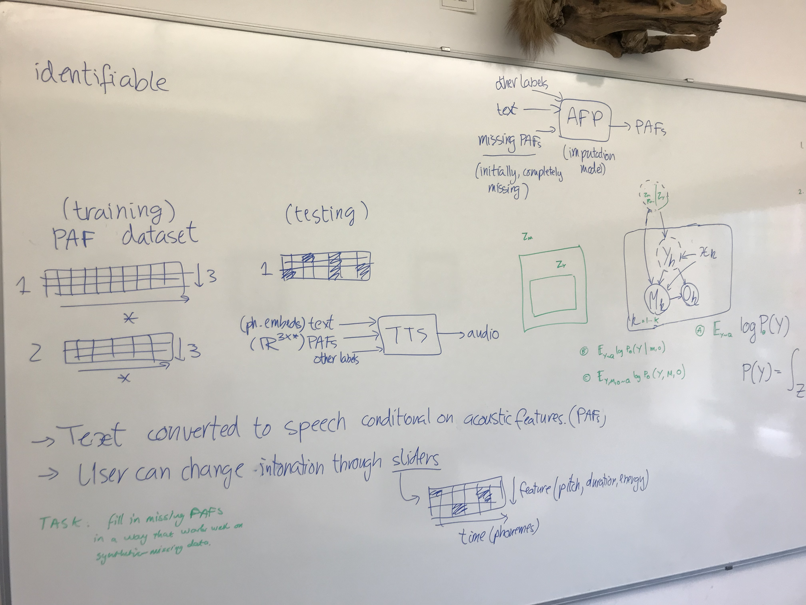
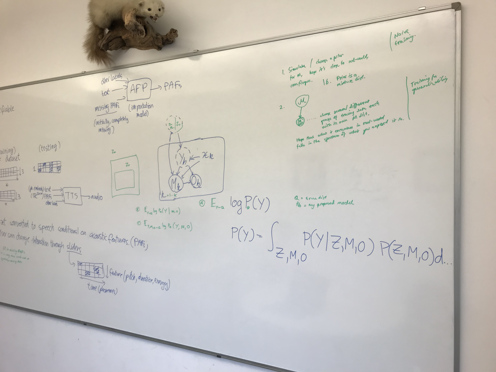
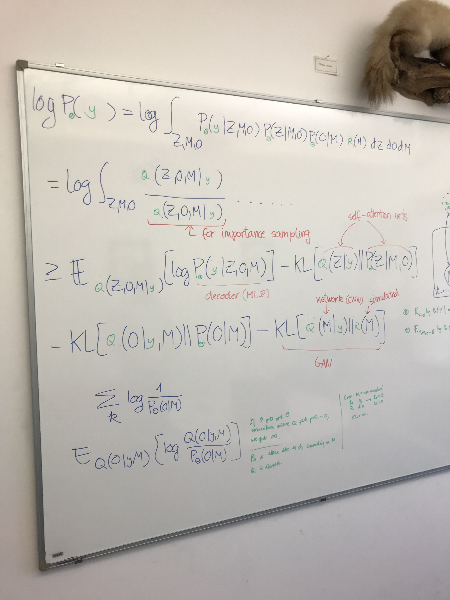
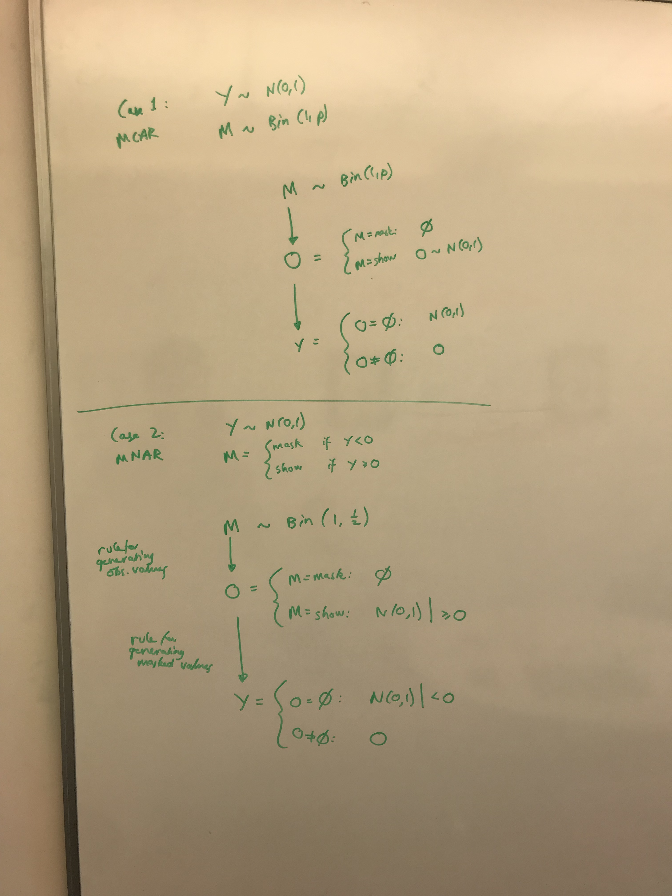

# July 2023

## Meeting Damon - 2023-07-21

1. **Background.**  We are generating speech audio. We have a TTS module converting text (in the form of phoneme embeddings) and acoustic features (in the form of a 3x* matrix), plus some other labels, into audio waveform. This model is a large Transformer (called the Tacotron). The acoustic features (PAFs) are generated by another network, called the Acoustic Feature Predictor (AFP). This module takes as input the text embeddings, other labels and produces the matrix of acoustic features.
2. **Problem.** The output voices are realistic, but they are not expressive or emotional. We want to be able to control the output prosody (intonation, rhythm, volume) in order to express the right emotions. The best approach to do this is to condition the AFP on some extra inputs such that the generated acoustic features.
3. **Naive approach.** The current approaches to this problem suffer from a lack of precision. Some people condition on human-provided labels like "question" or "shouting". These are not expressive enough. There are also heuristic rules for changing
4. **Missing data problem setup.** So we have a pre-trained TTS module. We have a training set for the AFP module, consisting of tuples of (audio waveforms, text embeddings, and acoustic features). The acoustic features are extracted deterministically from the audio (they are pitch, duration and energy). We have all 3 features per each phoneme. The task is that the AFP should take as input a matrix of (possibly missing) acoustic features, along with the text embeddings, and generate a complete matrix of acoustic features. This is called missing data imputation. The goal is that the imputation is as realistic as possible. Users provide values for the acoustic features through a set of visual sliders.
5. **Challanges.** We want 2 things from the imputation: 1) Efficiency. The generated audio should be as realistic as possible with the least number of control points from the user. We don't want the user to provide too many values before the imputation is what they wanted. 2) Robustness. The imputation should work well across many patterns of missingness. We don't know beforehand exactly what the patterns of missingness will be (one word at a time, random points).
6. **Missing-not-at-random.** We can't just use any method for imputation here, because the data is MNAR. This means that whether or not the data is missing depends on the value of the acoustic features themselves. For example, if the user decides to only provide values for the stressed word in the sentence (and this is a realistic use case), then the provided values will, on average, have higher pitch than the rest of the sentence. Normal imputation methods using deep learning, like Denoising VAE, GAN, Diffusion models, Transformers, don't impute well in this situation. Neither do Gaussian Processes or Neural Processes.
7. **Why is this important?** Missing-not-at-random is a very common situation. One situation is self-censoring. Another is the shared parameter model.
8. **Why do existing models not work in this situation?** Existing models don't work in our situation because our situation is very specific. Usually, people assume that the training setup is identical to the testing data: namely we have the same pattern of missingness. What they do is train a full generative model and then infer the missing data as a latent variable. But this is not our setting. In our setting, we don't know exactly what the patterns of missingness will be at test time. However, during training we have as much complete data as we want. 
9. **So what solution do you propose?** In our case, the missingness is the latent variable. In their case, the missing data is the latent variable.
10. **How do you know your method will impute correctly?** We prove that our method for imputation is identifiable. Identifiability is a guarantee that basically means that if your model fits the data, then it is correct. You have to assume that the data has been generated by a model like yours.
11. **How well does it perform in practice?** First, let's listen to some samples and take a look at the data.
12. **How can we measure the performance objectively?** We design an evaluation procedure that measures the imputation quality as a function of the number of PAFs provided and the pattern of missingness.
13. **What are the results?**
14. **Conclusion.**

- I am actually proposing a different generative model from the one proposed in the identifiability paper, which is a selection model.

## Generalisation to new patterns of missingness

