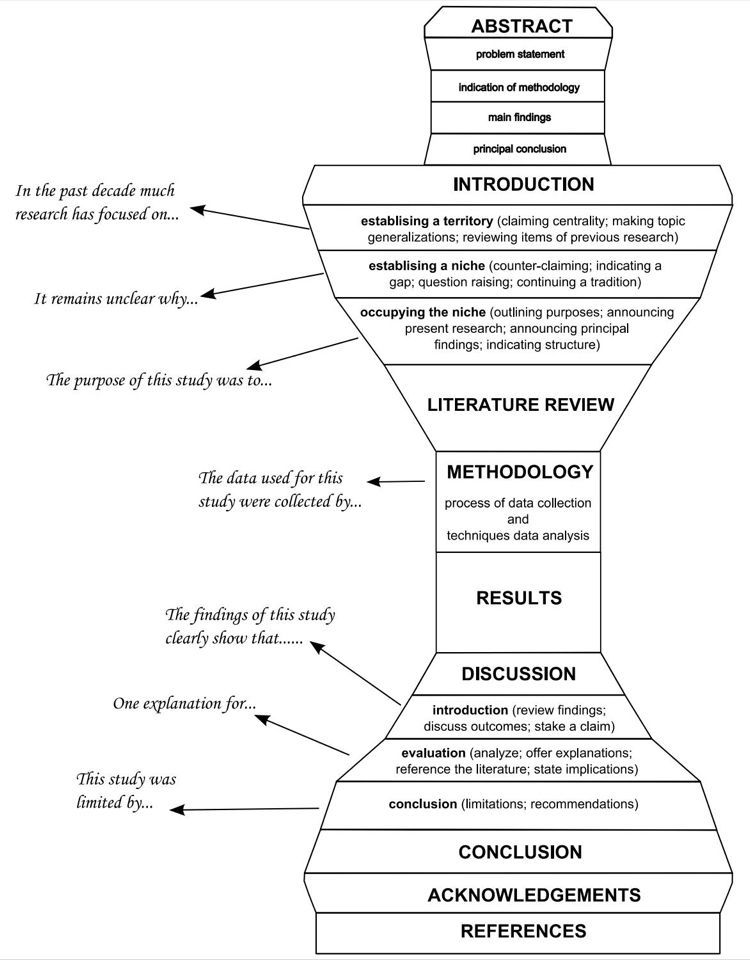
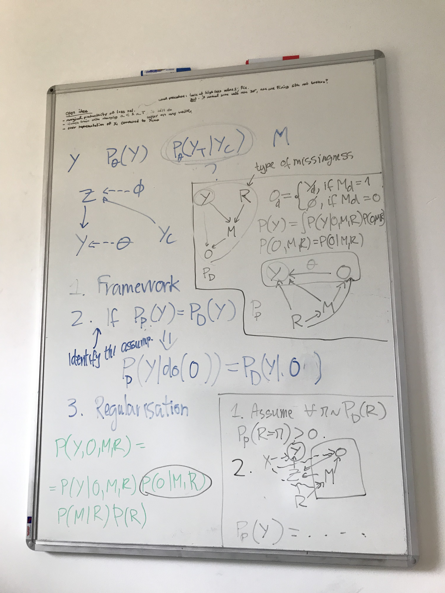
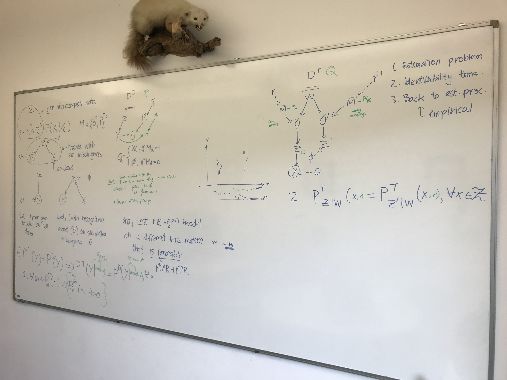
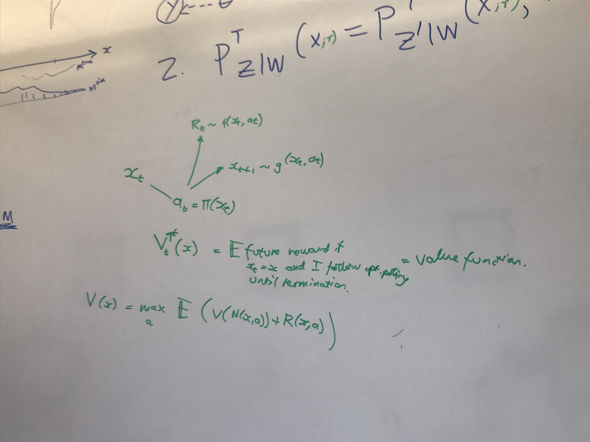

# August 2023

## Chao Ma - 2023-08-07

I also want to do imputation for non-ignorable missingness. But I'm interested in a slightly different problem setup. I assume that the training data is complete (but we don't see examples of missingness) and that the testing data will have missingness not-at-random. You can see this as: "How can you extract a conditional distribution from a generative model that has learned joint distribution learned during training?" I'm curious how relevant the framing of MNAR is for my model?

- Non-ignorable missingness means that, if you train a model only on complete data, the parameter estimate will be biased. In practice, something like denoising works by corrupting data in a simple way during training, and then corrupting it in a new way during testing. Is that the same thing?
- Rubin proposes that you model the joint distribution of the missingness and the data. Is that identifiable? Can Expectation Maximisation uniquely identify the correct generative parameter?
- What do the assumptions translate to in practice?
- Intuitively, how can it be possible to learn with self-censoring? Is it due to the conditioning of the latent?
- What conditioning do you usually use.

When the training data is complete, the problem is not with the generator (you can train that perfectly well on the training set), the problem is with the encoder.

## Discussion with Omer - 2023-08-09

Why can varying the context set size during training produce better performance on the testing set than actually training with that very same context set? There must be some robustness to unseen variation learned there.

## Group disentanglement 

The goal of group-disentanglement is to learn separate latent representations, one that captures within-group variation and another that captures across-group variation. We call across-group variation *style* and within-group variation *content*.

It was proven that, under certain assumptions, the style and content variables can be uniquely identified by a Variational Autoencoder (up to an invertible function).

But, the problem is that one of the assumptions is not realistic for many real-world cases. They assume that the style and content variables are independent conditional on the data, which is wrong if we look at the probabilistic model. Actually, they assume that the function mapping the latent variables to the data is invertible. 

The assumption is not only wrong, but also creates many problems in real-world cases. Often times, the instance variable cannot be correctly inferred independently of the rest of the variables in the group. The same data observation can correspond to many different combinations of latent variable realisations. 

We can think of many examples. The same test score can correspond to different academic aptitudes depending on the school where the student attended. The same shadow can correspond to different 3D shapes depending on where it is viewed from. The same colour in the image could have been generated by many combinations of light and surface. The same heart-rate could be dangerous for one individual and safe for another. We also want to learn fair and relevant representations that are independent of a sensitive variable (this is the opposite to agumentation-invariance).

What are the requirements for a good dataset?
1. The same data can correspond to many combinations of latents.
2. The interaction between latents is not trivial (additive).
3. A human can intuitively understand when a translation is correct and when it is wrong.
4. It corresponds to an important real-world problem that we would like ML to solve.
5. The data is high-dimensional.

- Abstract visual reasoning. Raven's progressive matrices. We need to add a parameter (positional encoding) to denote the location in the rows and columns.
- Learning fair representations with no labels.
- Collaborative filtering. What reaction will this guy have when those other guys had those reactions? There is a problem: how do you learn the pattern for this guy when there is no correspondence between items?

So what do I contribute? Well, 2 things. 

1. Firstly, I use the correct derivation of the latent posterior, which theoretically allows for the identification of the style and content variables even in cases where the generative function is not invertible.
2. Secondly, I propose an alternative objective to maximum likelihood estimation (maybe a regulariser) that ensures the learning of disentangled representations. I show empirically that the model trained with this objective learns a disentangled representation.

I show empirically on a toy dataset and a real dataset that the model learns to disentangle. I measure disentanglement per-se (i.e. how well each latent predicts the correct ground-truth value and how poorly it predicts the incorrect value) and also measure translation.

## Missing data imputation

1. **Establish a territory.** You have learned a joint distribution over the dimensions of a variable $Y$. You are given a set a dimensions (called the context set) $Y_C$ and you want to estimate the probability of the rest of the dimensions (the target set) $P(Y_T | Y_C)$. The standard approach is to train the model by sampling a selection variable $M$ assigning each dimension of $Y$ to either the context set or the target set.
2. **Establish an unoccupied niche.** We don't quite understand why the distribution that we choose for $M$ affects the learned distribution $P(Y_T | Y_C)$. 
   1. Practically, it's common knowledge that the split between context and target affects what you end up learning.
      1. In computer vision, everyone knows that you can't train a model with Bernoulli random missingness and expect it to correctly impaint a large contiguous region of the image.
      2. In time-series forecasting / language modelling, it's a common approach to vary the length of the context set, because it produces more robust results than simply forecasting. Also, we all know that a model trained to predict the next time-step will explode when asked to predict the next 100 timesteps.
      3. Also, what is the difference between language modelling and text embeddings? The pattern of missingness during training.
   2. But there is not theoretical framework for understanding what's going on here. The theory of missing data imputation deals with situations where you don't see the complete data, but you see the missingness pattern that you will encounter during testing. This situation is the opposite: You can perfectly model the data, but you don't know what the missingness pattern will be during testing.
      1. Theoretically, if you can learn the joint distribution of the data, you also get the conditional distribution for free. Let's look at an example. Usually, generative models map a latent variable $Z$ to an observed variable $Y$. If we assume that the generative model is correct, than we can infer $Z$ from the partial observation using expectation maximisation, whatever the pattern of missingness is.
      2. However, this method is slow. In practice, we want to do amortised inference. We want to learn a model $\phi$ to sample the latent variable. 
      3. And here is the problem. Even if $\theta$ might be the correct generative parameter, $\phi$ might be wrong.
3. **Occupy the niche.** I establish a probabilistic framework for understanding why missingness impacts the learned distribution. I identify a set of assumptions about the model and the data generating processs for which the model is identifiable. And I propose an alternative regularisation loss term that helps the model in practice learn robust imputation at test time.
   1. So what is the framework? We assume a probabilistic model for the true data generating process $P_D$. The joint distribution factorises according to $P(Y, O, M, R) = P(O | Y, M) ~ P(M | Y, R) ~ P(Y) ~ P(R)$.
   2. We assume a different parametric probabilistic model $P_\theta$ that we can train. What we want to do is find the assumptions about the true data generating model and the parametric model that make $P(Y | O)$ identifiable. Identifiable means that, if the parameter maximises the data likelihood $P_\theta (Y) = P_D (Y)$, then the conditional distribution is the same $P_\theta (Y | O) = P_D (Y | O)$.
      1. We assume a generative model where the joint distribution factorises like this $P (Y, O, M, R) = P_\theta (Y | \underline{O}) ~ \prod P(O | R, M) ~ P(M | R) ~ P(R)$.
      2. We assume that for different samplings of $M, R$, the generated $Y$ is the same.
      3. We assume that $R$ and $M$ in $P_D$ have non-zero probability wherever $P_\theta$ puts non-zero probability.
   3. We derive a VAE model from the proposed parametric model. Add a regularisation term that ensures the $Y$ variables are the same. 

Ok so what is the contribution? Let's enumerate the choices.

1. I can prove that the model is identifiable under some assumptions. There is basically no improvement in the model itself, it's just an identifiability proof. This requires the 2 proofs and then a few extra experiments: toy data for the imputation and an abstract visual reasoning task for the disentanglement.
   1. For the missing data imputation, I can prove that the generative recognition model parameter is identifiable under certain assumptions about the prior over the missingness pattern.
   2. For the group-instance disentanglement, I can prove that the latent group and instance variables are identifiable under a wider set of assumptions than in the self-supervised paper.
2. I can provide a different learning procedure (inspired by IPTW, instrumental variables or double machine learning) that can help with learning representations that are generalisable (both to different patterns of data and different patterns of missingness). This will require a host of new experiments, but not necessarily a proof.

## Identifiability of missing data imputation

Let $\Omega$ be a parameter space and $\mathbb{P}_{\theta, \phi}, \mathbb{P}_{\theta^*, \phi^*}$ be two models on the variables $(X^U, X^O, R)$ that satisfy the following conditions:

1. **Data Setting D1.** The true data generating distribution of the data and the missingness factors according to the selection model $\mathbb{P}_\mathcal{D} (X^U, X^O, R) = \int \mathbb{P}_{\theta} (X | Z) ~ \mathbb{P}_{\psi} (R | X, Z) ~ dZ$ where the data generating distribution factorises in along the group (but is not necessarily exchangeable) $\mathbb{P}_{\theta} (X | Z) = \prod_d \mathbb{P}_{\theta_d} (X_d | Z)$ and the missingness selection model factorises likewise $\mathbb{P}_{\psi} (R | X, Z) = \prod_d \mathbb{P}_{\psi_d} (R_d | X, Z)$. The parameters belong to the fixed parameter space $(\theta, \psi) \in \Omega$.
2. **Assumption A2.** We assume that the parameters are identifiable over subsets of the dimensions. There exists a partition on the set of dimensions $A_\mathcal{I} = \{C_s ~|~ 1 \leq s \leq S, C_s \subseteq \mathcal{I}\}$ (where $\cup_s C_s = \mathcal{I}$ and $C_a \cap C_b = \emptyset, ~ a, b \in \{1:S\}$) such that for each subset in the partition $C_s$ the corresponding parameters $\theta_{C_s}$ can be identified with only the corresponding dimensions of the data $X_{C_s}$.
3. **Assumption A3.** We assume that the data-generating process is positive for a certain set of important patterns. There exists a cover on the set of dimensions $B_\mathcal{I} = \{C_l ~|~ 1 \leq l \leq L, ~ C_l \subseteq \mathcal{I}\}$ (where $\cup_s C_s = \mathcal{I}$) such that: 
   1. The data distribution is positive when the pattern $\mathbb{P}(X = x | R_{C_l} = 1, R_{\mathcal{I} \setminus C_l}) > 0, ~ \forall x \in \mathcal{X}$
   2. For all dimensions in the subset of a partition $\forall c \in C_l$ there exists a subset from the partition of Assumption 2, $C_s \in A_\mathcal{I}$, where $c \in C_l \subseteq C_s$.

## Identifiability of style-content disentanglement

**Definition. (Block-identifiability)** We say that the function $g: \mathcal{X} \to \mathcal{Z}$ block-identifies the true content partition $\mathbf{c} = f^{-1} (\mathbf{x})_{1:n_c}$ if for the inferred content partition $\hat{\mathbf{c}} = g(\mathbf{x})_{1:n_c}$ there exists an invertible function $h$ such that $\mathbf{c} = h (\hat{\mathbf{c}})$.

**Theorem. (Identifiability of content)** Assume a generative model $G = (\mathbb{P}_\mathbf{z}, \mathbb{P}_{\mathbf{A}}, \mathbb{P}_{\tilde{\mathbf{s}}_A | \mathbf{s}_A}, f)$ with the following properties:

1. To generate the original view, first sample the latent $\mathbf{z} \sim \mathbb{P}_{\mathbf{z}}$ and then deterministically generate the observation $\mathbf{x} = f(\mathbf{z})$.
2. To generate the augmented view, first sample the augmented latent $\tilde{\mathbf{z}} \sim \mathbb{P}_{\mathbf{\tilde{z}} | \mathbf{z}}$ and then deterministically generate the observation $\tilde{\mathbf{x}} = f(\tilde{\mathbf{z}})$.
3. **Content invariance.** All the variability in the augmentation distribution comes from the style variable $\mathbb{P}_{\tilde{\mathbf{z}} | \mathbf{z}} (\tilde{z} | z) = \delta (\tilde{c} - c) ~ \mathbb{P}_{\tilde{\mathbf{s}} | \mathbf{s}} (\tilde{s} | s)$.
4. **Style change.** Consider the set of subsets of style dimensions $\mathcal{A} = \{A ~|~ A \subseteq \{1:n_s\}\}$ and a distribution on this set $\mathbb{P}_A$. Then, the style augmentation density is $\mathbb{P}_{{\tilde{\mathbf{s}} | \mathbf{s}}} (\tilde{s} | s) = \int \mathbb{P}_{\tilde{\mathbf{s}} | \mathbf{s}, \mathbf{A}} (\tilde{s} | s, A) ~ \mathbb{P}_\mathbf{A} (A) ~ dA$, where $\mathbb{P}_{\tilde{\mathbf{s}} | \mathbf{s}, \mathbf{A}} = \delta (\tilde{s}_{\setminus A} - s_{\setminus A}) ~ \mathbb{P}_{\tilde{\mathbf{s}}_A | \mathbf{s}_A} (\tilde{s}_A | s_A)$.
5. The generative function $f$ is smooth and invertible with a smooth inverse.
6. $\mathbb{P}_\mathbf{z}$ is smooth with $\mathbb{P}_\mathbf{z} (z) > 0$ almost everywhere.
7. For any style dimension $l \in \{1 : n_s\}$ there exists a subset of style dimensions $A \subseteq \{1 : n_s\}$ containing that dimension $l \in A$, such that for any realisation of the the variables in that subset $s_A$, there exists a subspace of the function space $\mathcal{W} \subseteq \mathcal{S}_A$ that contains the realisation $s_A \in \mathcal{W}$, such that the probability of the augmented view given the original view is greater than zero $\mathbb{P}_{\tilde{\mathbf{s}}_A | \mathbf{s}_A} (w | s_A) > 0$ for any value belonging in that subspace $w \in \mathcal{W}$. Basically, for each style dimension, there is a subset of style variables for which any realisation in the original view has a non-zero probability in the augmented view.
8. The style and content sets contain at least one dimension $1 \geq n_s < n$.

then, if there exists another generative model $\hat{G} = (\hat{\mathbb{P}}_\mathbf{z}, \hat{\mathbb{P}}_{\mathbf{A}}, \hat{\mathbb{P}}_{\tilde{\mathbf{s}}_A | \mathbf{s}_A}, \hat{f})$ that satisfies the same assumptions, and additionally, fits the joint distribution of the observations perfectly $\hat{\mathbb{P}}_{\tilde{\mathbf{x}}, \mathbf{x}} (\tilde{x}, x) = \mathbb{P}_{\tilde{\mathbf{x}}, \mathbf{x}} (\tilde{x}, x), ~ \forall (\tilde{x}, x) \in \mathcal{X} \times \mathcal{X}$, then the function $\hat{f}^{-1}$ block identifies the true content variable $\mathbf{c}$.

**Proof.** The proof comprises 2 steps:

1. In the first step, we show that the inferred latent is related to the true latent by an invertible mapping $\hat{\mathbf{z}} = h(\mathbf{z})$ and that the inferred latent satisfies invariance over the content components $\hat{\mathbf{c}} = h(\hat{\mathbf{z}})_{1:n_c} = h(\mathbf{z})_{1:n_c}$.
2. "Finally, smoothness and invertibility of $h_c$ follow from smoothness and invertibility of h, as established in Step 1." - WRONG!!!

## Anatomy of a paper

## Meeting with Zack - 2023-08-11

My questions
- Simplify claim. The claim is too complicated, too broad, and touches too many scientific fields.
  - Mentioning human-in-the-loop control is a problem, since we don't use actual users for evaluation. Maybe change to simple "control"?
  - Talk specifically about prosody control, or control in the context of speech, instead of generative models in general.
  - The sparse control space idea is too complicated. Let's call it simply imputation or inpainting.
    - Sparse inputs to predict the full output.
    - Discussion doesn't have to be the same space.
  - The uniqueness of our ML model is irrelevant at this stage. Just call it a deep generative model for missing data imputation. Take out Masked CVAE from the evaluation and the Robustness evaluation.
  - What is the related work? Other ways of conditioning speech models / rules for controlling prosody.
  - This is a cool way to do human-in-the-loop control.
- Not happy with the audio samples, but that's that.
- Clarify input, output. A description of the task.
- Change samples page so that it doesn't say ICML 2023. Access to Papercup server?
- Use control points instead of driving PAFs

### Zack's comments

- Sparse control is a clever approach.
- But in order to do that, we need a model that can overcome this awkward thing of masked inputs. This is a model that intelligently deals with sparse inputs (bag of features).
  - I should say that I designed this model for these reasons, this architecture is similar to this. I was taking away from the contribution. For your benefit, I will provide a comparison. This Ilse paper is related work.
  - The more detail I go into describing the model the better. What did you do and why that way. Describe the forward pass of the model.
- Clearer task description where we describe the prosody. Repeat the important things.
- When there is maths, be clear about the definition, what do they mean, especially inputs and outputs.
- Just call it control instead of HitL, reviewers will be more likely to accept automatic evaluation.

## Meeting with Damon - 2023-08-18

1. Estimation problem. Let's say we've already trained a generative model for full data $Z \to Y$. We want to infer $Z$ accurately from partial observations of $Y$. To do this, we train on simulated missingness. This is harder than it seems because the model might learn the wrong parameter due to a spurious correlation.
   1. 
2. Identifiability theorem. Under a certain set of conditions / assumptions, the inference model is identifiable under missing data: $\mathbb{P}^T (Y | O) = \mathbb{P}^D (Y | O)$.
   1. Maximum likelihood of data is achieved: $P^T (Y) = P^D (Y)$.
   2. Any true missingness pattern has a non-zero probability of appearing during the training $\forall m \sim P^D_M, ~ \forall r, ~ P^T (M=m ; r) > 0$.
   3. For two different missingness regimes, the distribution of the latent variable is the same. $\mathbb{P}_{Z|W} (z; r) = \mathbb{P}_{Z'|W} (z; r), ~ \forall z \in \mathcal{Z}$.
3. Back to estimation procedure.
   1. We derive the ELBO of the Variational Autoencoder corresponding to this graphical model.
4. Empirical evaluation.

What is the problem that we are trying to prove against? Let's say we have multiple values for the recognition parameter. Some of those values work well for the training data but poorly on the testing data. The training data is also split in environments, and it just so happens that the parameter values that work well across all possible environments also have small variability in their performance between environments. This is apparently because of causal invariance. 

Why does this happen? We are in the anticausal setting where the input is caused by the output. We want our representation to capture only the variability in the input that causes the output. In causal invariance this refers only to selecting which dimensions of the input are causes of the output, and which are not. Normal variability across environments produces a correlation between non-causal dimensions and outputs because different environments might have different distributions of outputs. Even when the marginal distribution of targets might be similar, the 

This is applicable with partial observations because the same true data could generate many different observations.

We propose a model for trying to predict an original variable from a corrupted observation where the corruption follows a different pattern under different environments. $Y$ is the original variable, $X$ is the corrupted observation, $H$ is the nuisance variable and $R$ is the variable controlling the distribution of noise. The joint distribution factorises like $P(Y, X, H, R) = P(X | Y, H) ~ P(H | Y, R) ~ P(Y | R) ~ P(R)$.

The question is, what assumptions do we want to make about the environments so that invariance uniquely identifies the causal dimensions?

## Causal Inference with Invariant Predictions

**Invariant prediction assumption.** There exists a vector of coefficients $\gamma^* \in \mathbb{R}^p$, whose support we call $S^* = \{k | \gamma^*_k \neq 0\} \subseteq \{1:p\}$, such that for all environments $r \in \mathcal{R}$, we can represent the target $Y^r$ as a linear function of the observations $X^r$ where $\gamma^*$ are the coefficients: $Y^r = \alpha + X^r \gamma^* + \epsilon^r$, where $\epsilon^r$ is a noise term independent of the subset of dimensions of the observation selected by the support of the coefficient $\epsilon^r \perp X^r_{S^*}$ sampled from an arbitrary unknown distribution $\epsilon^r \sim F_\epsilon$ with mean 0.

> This assumption is basically saying that, regardless of changes in the distribution of the observation, there exists a fixed linear function of the observation equal to the expected value of the target. Moreover, the distribution of the target around its expected value is independent of the value of the observation or the environment.

**Plausible causal predictors.** We call a subset of observable dimensions $S \subseteq \{1:p\}$ a plausible causal predictor under the set of environments $\mathcal{R}$ if the following null hypothesis holds true: 

$\mathcal{H}_S (\mathcal{R})$: There exists a set of coefficients $\gamma \in \mathbb{R}^p$ such that 

1. For all dimensions outside $S$ the value of the coefficient is $\gamma_k = 0, \forall k \in \{1:p\} \setminus S$.
2. For all environments $r \in \mathcal{R}$ the output can be written as a linear combination of the observations and the coefficients: $Y^r = \alpha + X^r \gamma + \epsilon^r$, where $\epsilon^r$ is independent of the observable dimensions in $S$ and is sampled from an arbitrary mean 0 distribution $F_\epsilon$.

Identifiable causal predictors for a set of environments $\mathcal{R}$ is defined as $S(\mathcal{R})$ the intersection of all the plausible causal predictors $S$.

> What happens when we only have one environment? ($|\mathcal{R}| = 1$) In that case, if $S$ is empty, we turn all $\gamma$ values to 0 and $\epsilon$ can model the whole variation in $Y$ because it doesn't need to be independent of any dimensions of $X$.
>
> The idea is that we can model the output as a function of 2 functions, one deterministic function $f$ takings as input one subset of input dimensions and another random function $g$ taking as input the rest of the observable dimensions and a completely independent error term $Y^r = h(f(X^r_S), ~ g(X^r_{\{1:p\} \setminus S}, \epsilon))$. One important condition is that the expected value of the output given the input must be the output of the first function $\mathbb{E} [Y^r | X^r] = \alpha + f(X^r_S)$.  
> 
> So the question is, why is the intersection of these sets always a subset of the parents of the $Y$ variable? Let's say the environments vary in only one direction.

The hypothesis is equivalent to $\mathcal{H}_S (\mathcal{R}): ~ \mathbb{P} (Y^r | X^r_S) = \mathbb{P} (Y^s | X^s_S), ~ \forall r, s \in \mathcal{R}$.

By definition $S(\mathcal{R}) \subseteq \mathrm{PA}(Y)$. Why? The identifiable set is an intersection of all variable sets that can model the different environments equally well.

**Identifiable causal parents.** If we assume a linear Gaussian model $Y^r = \sum_{k} \beta^r_k X^r_k + \epsilon$ where $\mathrm{PA} (Y) = \{k | k \in \{1:p\}, \beta_k \neq 0\}$, then we can prove that $S(\mathcal{R}) = \mathrm{PA} (Y)$ under the following assumptions about $\mathcal{R}$:

1. Between the two environments, every dimension of $X$ is intervened upon, and the true coefficients $\beta$ remain unchanged.