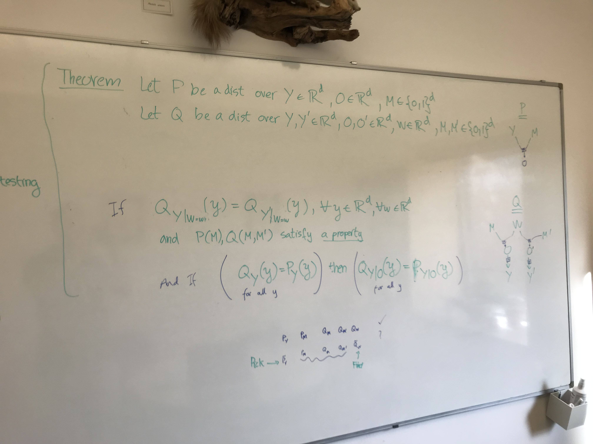

# September 2023

## Meeting with Damon

- The shape of the theorem is like this: Let $P$ be a distribution over $Y \in \mathbb{R}^D$, $O \in \mathbb{R}^D$, $M \in \{0,1\}^D$. Let $Q$ be an equivalent distribution $Y, Y', O, O' \in \mathbb{R}^D$, $M \in \{0,1\}^D$. If $f(Q_{Y | O}, Q_{Y' | O'}) = 0$ and $g(Q_{M}) = 0$ (where $f$ and $g$ are statements) and if $\forall y, ~ Q_Y (y) = P_Y (y)$, then $\forall y,o, ~ Q_{Y|O = o} (y) = P_{Y | O = o} (y)$.
- First of all, I should focus on writing the chapter. Making an extra contribution now might not be worth it. But I'm not happy with my contribution.
- Secondly, something is wrong with this identifiability business. The process that I am describing is related to regularisation, to encouraging the model to perform similarly well across different missingness types.

## Identifiability of imputation

What happens when there is complete missingness? How can that model perform just as well? Maybe I don't have to train across all the possibilities, but across specific interventions. That

Let's imagine that you try to predict the full data from partial data, and that we try to predict from the opposite pattern as well. The first prediction would be inaccurate. The second prediction would be inaccurate as well. Is there something we expect about the direction of the inaccuracy? Would the residuals be opposite? What does ground-truth Bayesian accumulation of evidence have to say about this?

Let's say we are in a situation where we condition on 2 variables $P(Y|X_1,X_2)$. How can we combine $P(Y | X_1)$ with $P(Y | X_2)$?

$$P(Y | X_1, X_2) = \frac{P(X_1 | Y) ~ P(X_2 | Y) ~ P(Y)}{P(X_1, X_2)}$$

$$= \frac{P(Y | X_1) ~ P(X_1) ~ P(Y | X_2) ~ P(X_2) ~ P(Y)}{P(Y)^2 ~ P(X_1, X_2)}$$

$$= P(Y | X_1) ~ P(Y | X_2) ~ \frac{P(X_1) ~ P(X_2)}{P(Y) ~ P(X_1, X_2)}$$

Now let's say that the two variables explain all of the variation $Y = (X_1, X_2)$. This means that $P(Y | X_1, X_2) = 1$ (assuming discrete variables) if the values are correct.

This means that, given $x_1, x_2$:

$$\mathbb{E}_{P (Y | x_1, x_2)} [\log P(Y | x_1, x_2)] = \mathbb{E}_{P (Y | x_1, x_2)} \left[\log P(Y | x_1) P(Y | x_2) \frac{P(X_1) ~ P(X_2)}{P(Y) ~ P(X_1, X_2)} \right]$$

$P(Y | x_1, x_2)$ is 1 when $Y = (x_1, x_2)$ and 0 else.

$$0 = \log P(x_2 | x_1) + \log P(x_1 | x_2) + \log P(x_1) + \log P(x_2) - 2 \log P(x_1, x_2)$$

$$\log P(x_2 | x_1) + \log P(x_1 | x_2) = \log \frac{P^2(x_1, x_2)}{P(x_1) P(x_2)}$$

Let's say we are in the discrete case, where $P(Y) = \frac{1}{n}$. Then, the probability of an observation is:

$$P(X_1) = \sum_{y, m} P(X_1 | y, m) ~ P(y) ~ P(m)$$

If we assume that each missingness pattern has equal probability, then

$$P(X_1) = \frac{1}{n} \#(X_1 = y_1)$$

So 

$$P(Y | X_1, X_2) = P(Y | X_1) ~ P(Y | X_2) ~ \# (X_1 = y_1) ~ \# (X_2 = y_2)$$

$$P(Y|X_1) ~ P(Y|X_2) = \frac{1}{\# (Y_1 = X_1) \# (Y_2 = X_2)}$$

Hang on,

$$P(X_1, X_2) = \sum_{Y} P(X_1, X_2 | Y) P(Y) = P(Y = (X_1, X_2))$$

### Adding information

The point of splitting one observation into two complementary missingness patterns is that the information from the two observations should add up to the information in one.

The information in one observation is $- \sum_Y P(Y) \log P(Y) = - P(X_1)$. 

$$P(Y) = P(X_2 | X_1) P(X_1) = P(X_1 | X_2) P(X_2)$$

- We can look at $\frac{P(X_2 | X_1)}{P(X_1 | X_2)} = \frac{P(X_2)}{P(X_1)}$ as a constraint. How would we implement the right half?

So what is the structure of the chapter is like this:

1. **Territory.** We have complete data during training and missing data during testing. We want to fill in the missing data.
2. **Niche.** There seems to be a problem with inferring the missing features, but no one has described it coherently.
   1. What are some examples? Varying the size of the context set helps with generalisability. 
   2. Is this the same as missing data imputation? No.
   3. A very important point is that we could train the missingness through expectation maximisation and achieve an unbiased estimator.
3. **Occupy the niche.** We propose a probabilistic model, a probabilistic understanding of the problem, a set of sufficient conditions for identifiability, and a new machine learning model that hopes to be identifiable.
   1. What is my theory of the problem? The missingness is a confounder, it distorts the relationship between the partial observations and the full observation. Why? Let's say that for the full data there are multiple parametrisations that achieve maximum likelihood, but only one that achieves maximum likelihood on every possible pattern of missingness. What does it mean to learn the correct distribution? Is the distribution learned by the model biased in any particular direction? Not necessarily. But it has higher variance than

**Theorem.** Let $P$ be a distribution over $Y \in \mathbb{R}^D$, $O \in \mathbb{R}^D$, $M \in \{0,1\}^D$. Let $Q$ be an equivalent distribution $Y, O, O' \in \mathbb{R}^D$, $M \in \{0,1\}^D$. 

If $\forall y, o, o', ~ Q_{Y|O}(y|o) ~ Q_{Y|O}(y|o') = \frac{P_{Y|O,O'}(y | o, o') P_Y (y) P_{O, O'} (o, o')}{P_{O} (o) ~ P_{O'} (o')}$

> Another way to say this is $\forall o, o', ~ \frac{Q(o' | o) Q(o | o')}{P(o, o')} = \frac{P(o, o')}{P(o) P(o')}$

and 

if $\forall y, ~ Q_Y (y) = P_Y (y)$, 

then $\forall y,o, ~ Q_{Y|O = o} (y) = P_{Y | O = o} (y)$.

**Proof.** Contradiction. Suppose there are 2 distributions Q satisfying this property, but they are different.

Suppose there exists a combination $y, o$ for which $Q(y | o) \neq P(y | o)$. 

> If the assumption is true, then we know that $Q(y | o') \neq P(y | o'), \forall o'$.
>
> $Q(y | o)$
>
I'm trying to find out if a statement about probability distributions is true or false. This is the statement: Given 2 random variables $A, B$ and 2 probability distributions $P, Q$ over those variables, if $\forall A, B, \frac{Q(A | B) Q(B | A)}{P(A, B)} = \frac{P(A, B)}{P(A) P(B)}$, then $\forall A, B, Q(A|B) = P(A | B), Q(B|A) = P(B | A)$. Is this statement true? If yes, prove it. If not, prove that it's not true. 

OK, no problem. Let's try to find a counterexample to the following statement $\exist A, B$ such that $Q(A|B) \neq P(A|B)$ or $Q(B|A) \neq P(B|A)$ and at the same time $\forall A, B$ then $\frac{Q(A | B) Q(B | A)}{P(A, B)} = \frac{P(A, B)}{P(A) P(B)}$. Can you find a $P, Q$ for which this is false?

Great, can you prove by contradiction that $\forall P,Q$ for which $\exist A, B$ such that either $P(A|B) \neq Q(A|B)$ or $P(B|A) \neq Q(B|A)$, then for those $P, Q$ and $\forall A, B$ we have $\frac{Q(A | B) Q(B | A)}{P(A, B)} \neq \frac{P(A, B)}{P(A) P(B)}$ ?

Assume without loss of generality that $P(A|B) \neq Q(A|B)$

$$\frac{Q(A | B) ~ Q(B | A)}{P(A, B)} = \frac{P(A, B)}{P(A) ~ P(B)}\to Q(A,B) = P(A,B)$$

$$\to \int P(A,B) dB = \int Q(A,B) dB \to P(A|B) = Q(A|B)$$

Nice! But is this true in expectation?

$$E_{P(A,B)}[\log Q(A | B) + \log Q(B | A) - \log P(A, B)]$$

$$P()$$

### Damon's comments

- Condition where the top is true but the bottom is not identifcally equal to Q.
- Always write down a DAG.
- Quantification: $\exists$, $\forall$. Look for dangling variables.
