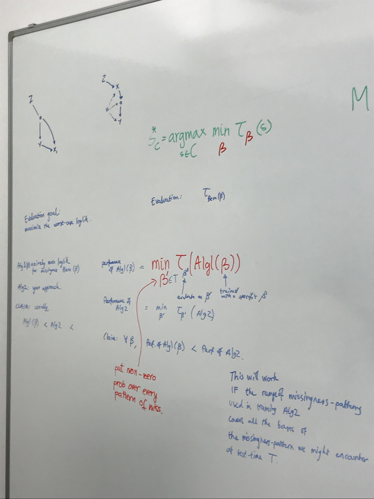
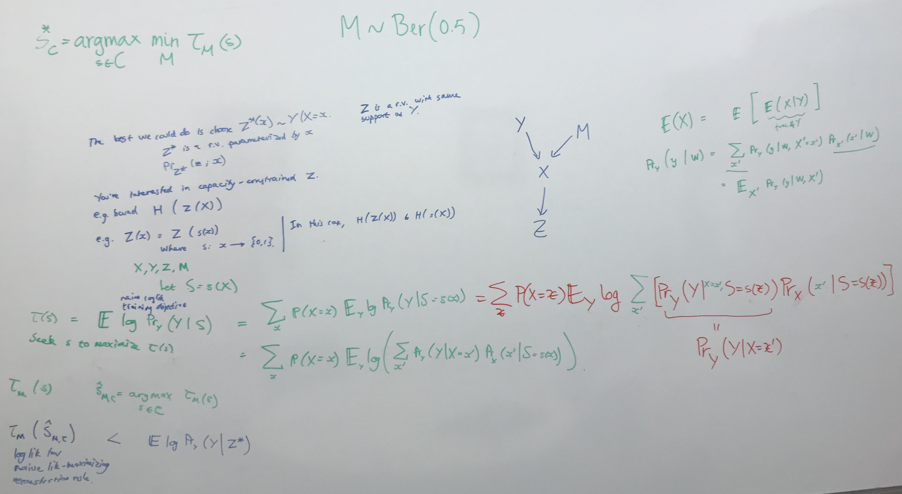
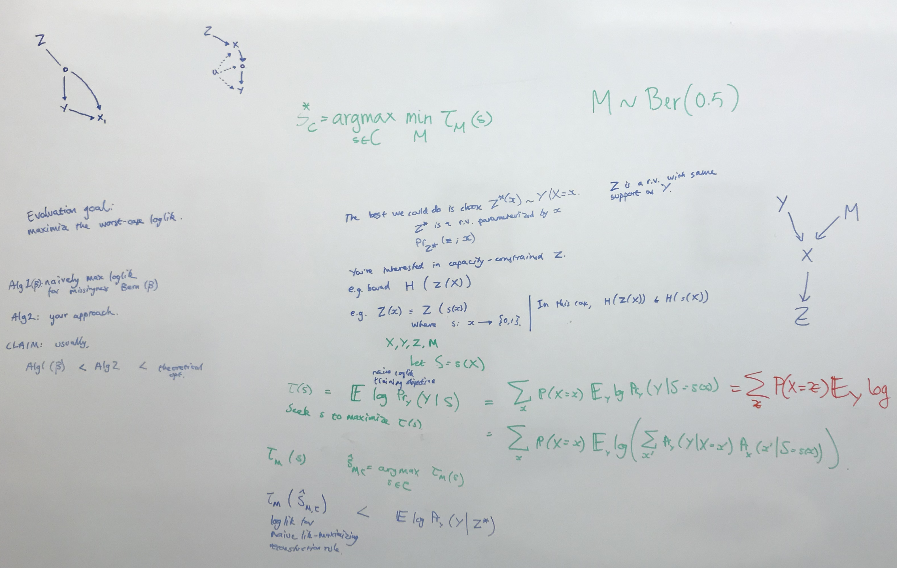
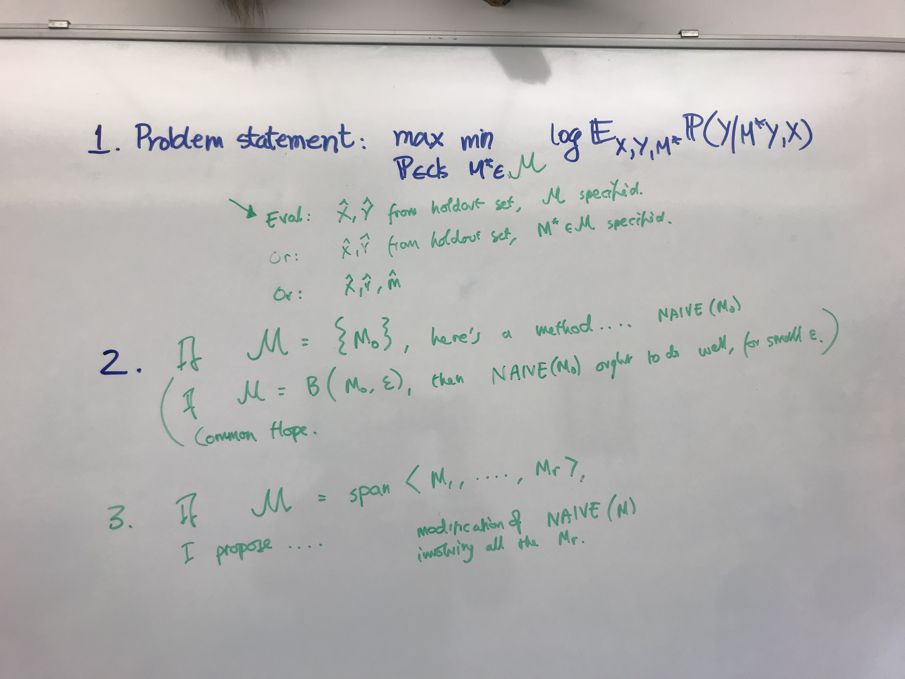
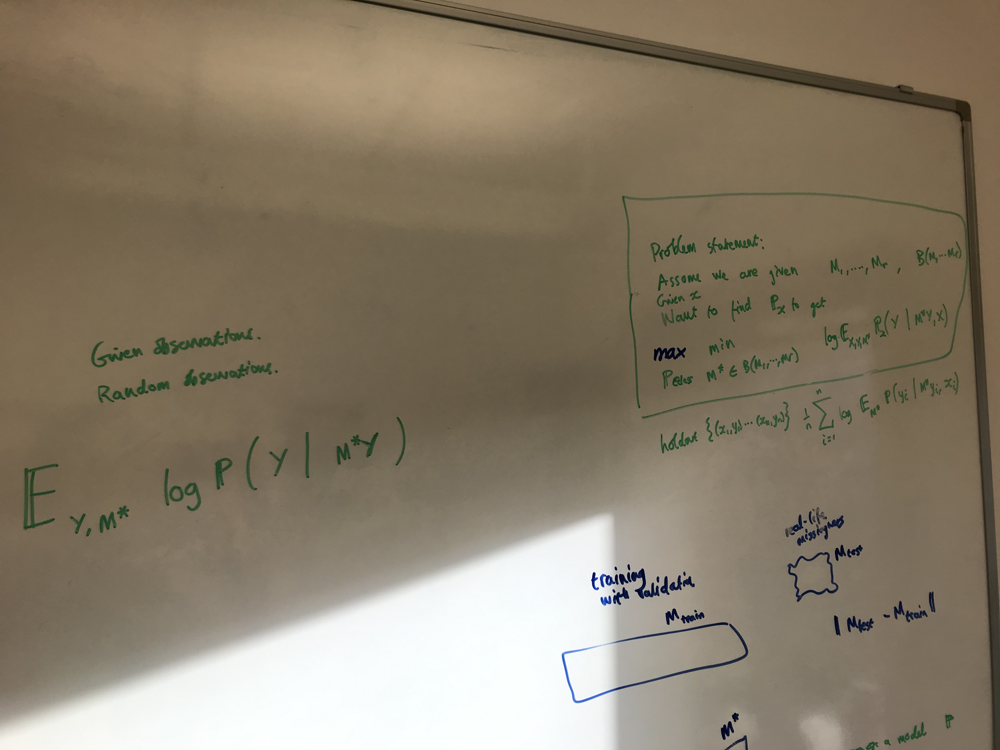
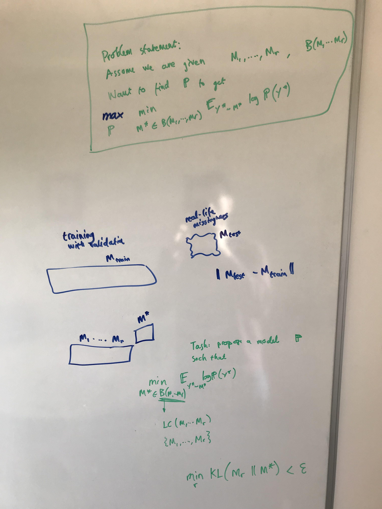
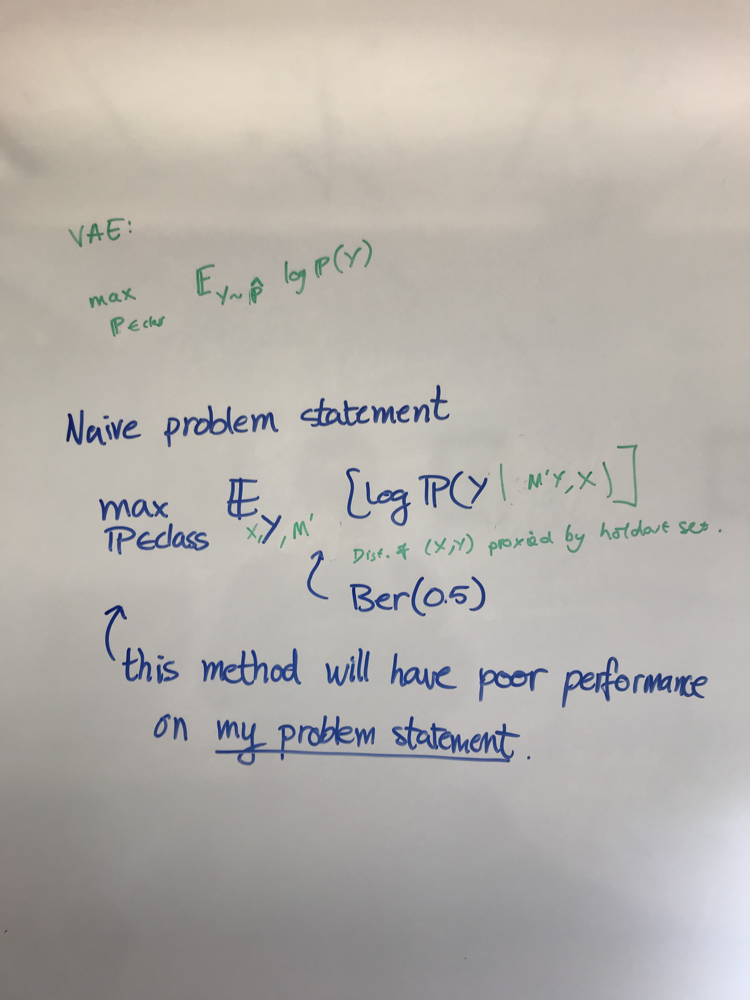
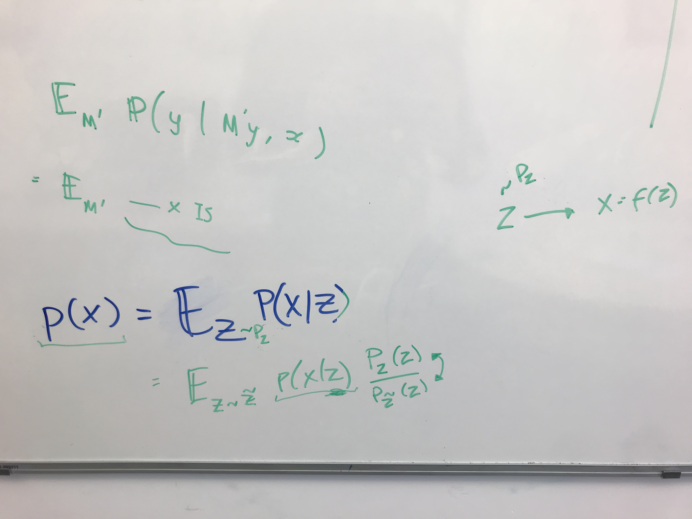

# October 2023

## Meeting Damon - 2023-10-06

- The ground-truth objective is $\argmax_s \min_\beta \mathbb{E}_{P_s(Z|X) P(X|Y,M) P(Y) P_\beta(M)} [ \log P(Y | Z)]$.

There are 4 algorithms.

1. $\mathrm{Algo}_1 (\beta)$ is an imputation model trained with maximum likelihood estimation on a pattern of missingnes sampled from a distribution with parameter $\beta$. This is the conventional approach.
2. $\mathrm{Algo}_2 (\beta)$ is an imputation model trained with my special objective on a distribution of missingness with parameter $\beta$.
3. $\mathrm{Algo}_3$ is an imputation model trained with robustness across a range of distributions of patterns of missingness.
4. $\mathrm{Algo}_T$ is the true conditional distribution $\mathbb{P} (Y|X)$.

Claim:

$$\tau_\beta (s) = \sum_x \mathbb{P}_X (x) \mathbb{E}_Y \log \sum_{x'} \mathbb{P} \mathbb{P}$$

Damon's suggestion: The chapter should work without the theory and identifiability proof. Write 1 page in words about the theory.

## Controlling prosody

My project is about groups and interventions. Each pattern of missingness is an intervention on the content of the image.

What is the probabilistic model? The missingness $M_k$ and the data $Y_k$ are sampled independently and controlled by the parameter $x_k$ which represents the location in the sentence. The partial observation is obtained by combining the two variables. There is another variable, $X_k$ specifying the phoneme, generated by $Y_k$, and generating $M$.

This is implemented as a variational autoencoder.

I propose a regularising loss function that encourages the learning of an imputation method that is robust to changes in the distribution of patterns of missingness. 

The loss goes like this: We choose a set of K distributions over patterns of missingness. We sample one pattern of missingness from each distribution and apply them to the same observation. We infer the latent representation corresponding to each pattern of missingness and then combine them with a simple function. The assumption here is that the partial observations with the patterns of missingness have maximal mutual information.

So, the options for the regularising loss are: 1) simple combination of predictions for each pattern of missingness 2) constraining the predictions from multiple missingness patterns to be equal 2) combining the positive with the negative 3) constraining the combination of positive and negative to follow the correct distribution.

$$P(Y | A, B) = P(Y|A) P(Y|B) \frac{P(A) P(B) P(A,B)}{P(Y)^3}$$

The evaluation consists of showing that this training procedure is better than training normally with: 1) 0.5 Bernoulli missingness 2) either of the patterns of missingness 3) all patterns of missingness pooled together 4) other regularisation procedures.

We can have multiple train-test splits. 1) Some patterns of missingness are in training and others are in testing. 2) Iterative refinement with maximum error as a criterion for feature specification.

What are some of the patterns of missingness? 1) 0.5 Bernoulli missingness. 2) Provide one word at random. 3) Remove one word at random. 4) Provide every stressed vowel. 5) Provide the n rarest phonemes, with n sampled uniformly.

What is the point of iterative refinement? It is a complex pattern of missingness that is hard to train for and reflects the realistic use-case. We perform this experiment with human subjects in order to show how well our method does with human-in-the-loop control.

## Meeting Damon - 2023-10-26

1. Problem statement: $\max_{\mathbb{P}} \min_{M^* \in \mathcal{M}} \log \mathbb{E}_{X,Y,M^*} [\mathbb{P} (Y | M^*Y, X)]$. Actually, I think the correct formulation is $\max_\mathbb{P} \min_{M^* \in \mathcal{M}} \mathbb{E}_{Y} [\log \mathbb{E}_{X,M^*} [\mathbb{P} (Y | M^*Y, X)]]$. But maybe not. What is the difference between $E_X[Q(X)] = \int_x P(x) Q(x)$ and $E_X[\log Q(X)] = \int_x P(x) \log Q(x)$? $\mathbb{E}_{Y, X, M^*} [\log \mathbb{P} (Y | Y, X, M^*)]$. In the evaluation, X, Y are different samples from the distribution, and M is a different missingness types

2. Naive approach: When the space of missingness is fixed, the solution is obvious and accepted by the literature. This is a common hope. If $\mathcal{M} = B(M_0, \epsilon)$, then the naive solution ought to do well, if $\epsilon$ is small. The naive problems statement $\max_{\mathbb{P}} \mathbb{E}_{X,Y,M'} [\log \mathbb{P}(Y| M'Y,X)]$. This will have poor performance on my problem statement.

3. When the space of missingness is complex, I propose my own solution, starting from the naive solution as a basis. If $\mathcal{M} = \mathrm{span}<M_1, \dots, M_r>$. I propose a modification of the naive method involving all of $M_r$.

|  |  |
| --------------------------- | --------------------------- |

- When defining the problem statement, there is the real situation, and then there is my formalisation, which forms the basis of the evaluation procedure. In the real problem statement, we have complete data at training time, an unknown pattern of missingness at testing time.

|  |  |
| --------------------------- | --------------------------- |

- Introduce the naive problem statement and claim that the method following that will have poor performance on our statement.
- When deducing the expectation lower bound, always make clear what is the generative distribution and what is the importance sampling distribution. Show 3 steps: 1) insertion of random variables by sum rule 2) introduction of the sampling distribution 3) final form of the ELBO.