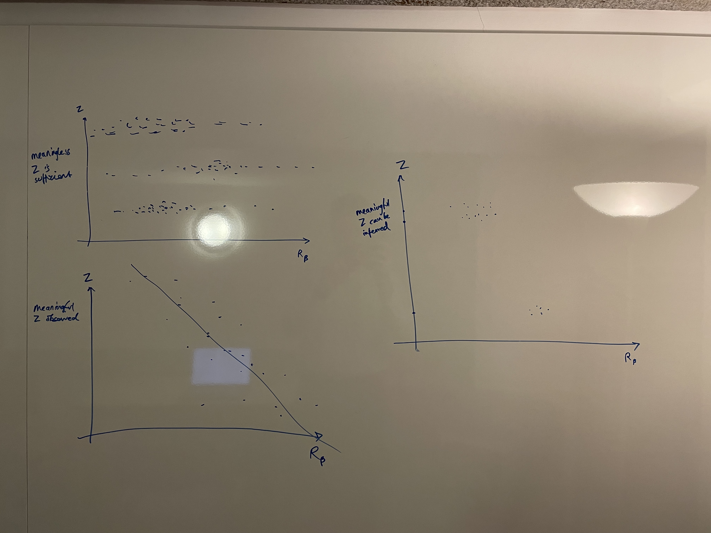
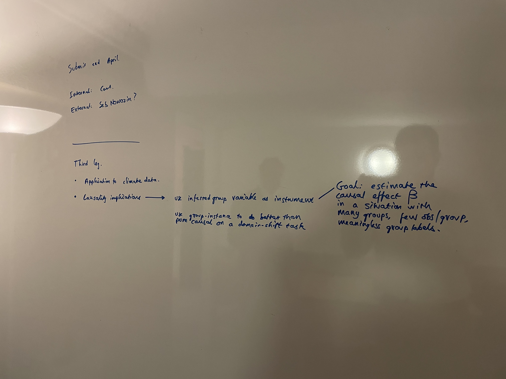
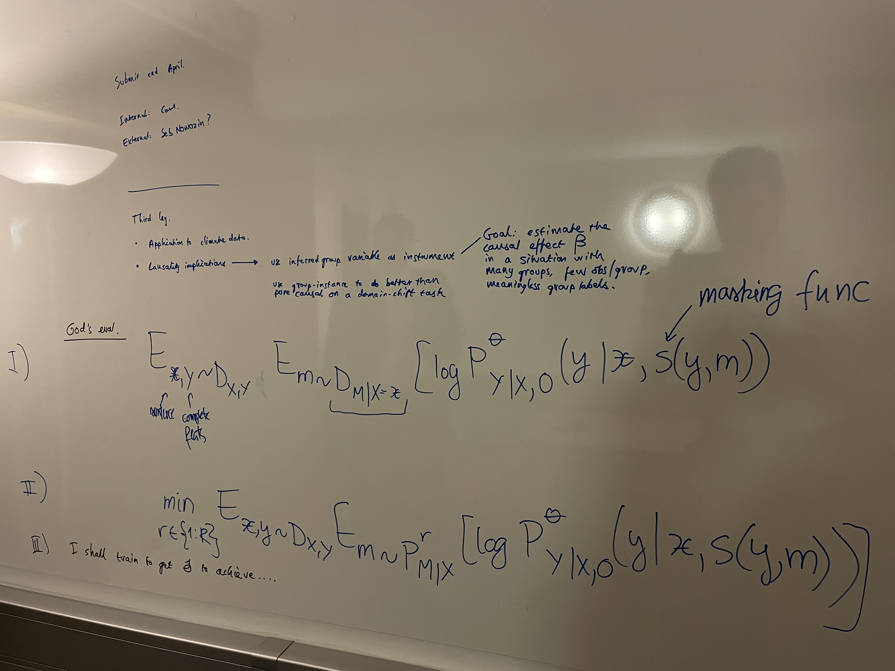

# January 2024

What experiments do I still have to run?

1. Show that when the network has enough capacity, training with 0.5 bernoulli missingness can achieve the best imputation under any missingness distribution. However, when network capacity is limited, there are better training algorithms for achieving the best worst-case performance.
    1. How do we weight the different samples based on how likely they are (see formula)
2. Experiment with group-instance disentanglement.

## Meeting Damon --- 2024-01-26

- Inferring the group variable and using it as an instrument. Many groups and small-ish. Read econometrician stuff and remind myself about Peters.
- Showing that GID can do more than the causal predictor in a problem of domain-shift.
- GID to forecast multiple time-series.

## Why Shift

- The propose a study of benchmarks and tests for Y|X shifts (conditional shifts). Usually people focus on covariate shifts.
- Existing approaches to deal with Y|X shift include distributionally robust optimisation (focuses on optimising worst-case performance) and causal learning (finds invariant rule).
- As a benchmark for Y|X shift, they use real-world tabular data constructed from the US Census
- Some regions of the X,Y space will have stronger shift between environments than others. Collecting more data from those regions will help during training
- They also note that adding a covariate helps
- Example dataset: try to predict severity of car accident from different covariates over different US States (the environment).
- Measure loss of lack of generalisability between domains S and T as relative regret:

$$\frac{\mathbb{E}_{P_T (X, Y)} [l(Y, f_S (X))]}{\underset{f}{\mathrm{min}} ~ \mathbb{E}_{P_T(X, Y)} [l(Y, f(X))]}, ~~~ f_S = \underset{f}{\mathrm{arg ~ min}} ~ \mathbb{E}_{P_S(X, Y)} [l(Y, f(X))]$$

- Improving data collection will yield better results than improving algorithms.

## Meeting Damon

- Use the language of invariant predictions, don't talk about causality and don't talk about confounders.
- In the situation of entanglement, we want catastrophic forgetting. If there is non-entanglement, we would hope to make great predictions.
- Risk modelling is a niche.
- Group predictor better than invariant predictions is last point.