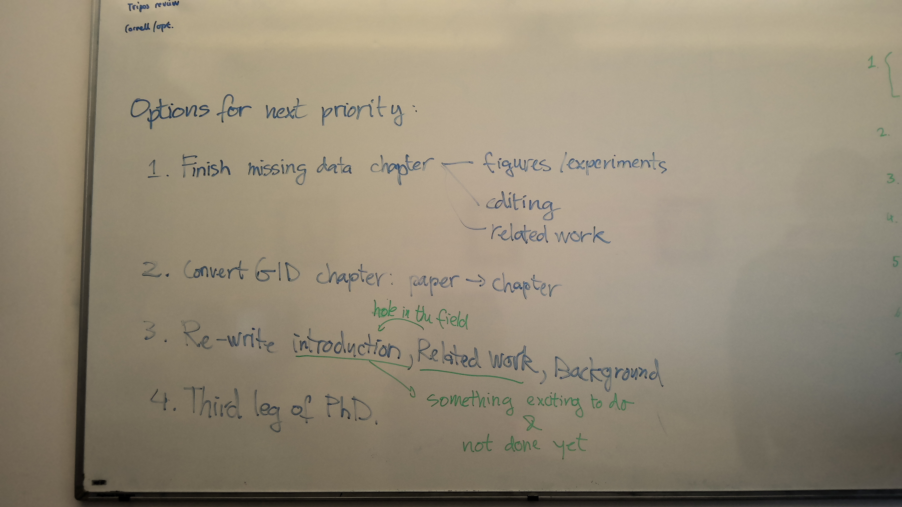
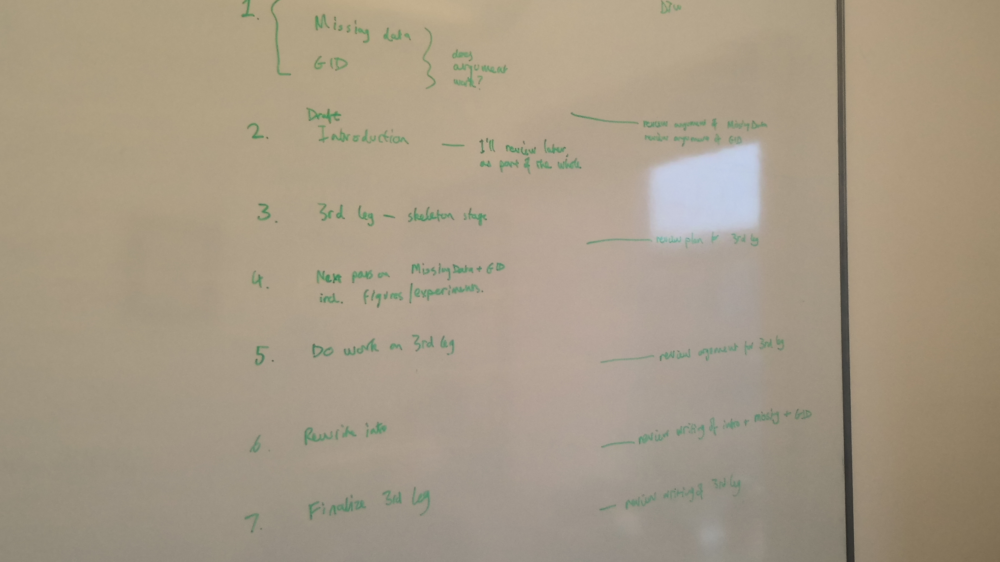
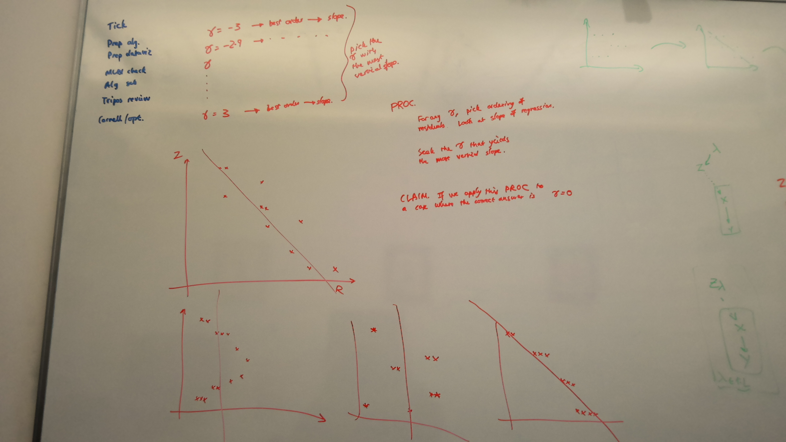
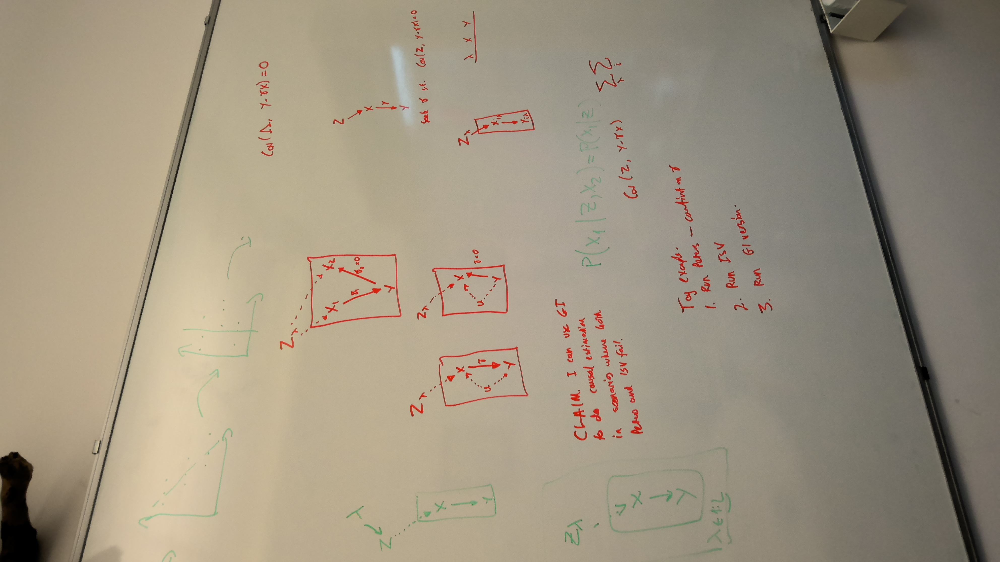
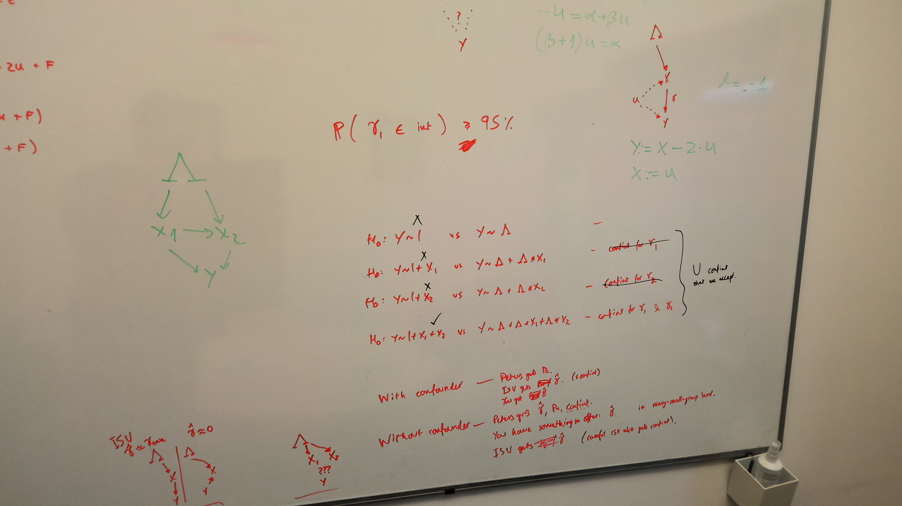

# February 2024

## Feedback from Omer - GID Paper --- 2024-02-07

Must

- Variables are different in figure than in equation.
- What are the arrows and why do the arrows have different colours.
- Chapter 4. Why is it the correct factorisation? Explain. It's not correct, it's just that it does not assume.
- 3rd paragraph intro, this definition of is not clear, using $i, j$ for groups, or at least consistent notation.

Optional

- What is contributing most? Adv part or ELBO part
- Last sentence in 3.1. See experiments for proof of that claim.
- Collider
- Why is it not invertible in the case of conditional shift.
- Notation with v,x,u

## Meeting Damon --- 2024-02-16

Damon will give feedback on contribution chapters in 3 stages. (1) Are the ideas right? (2) Does the argument makes sense? (3) Is the style good?

What are the steps until PhD submission? Damon will be away in April.

| Deadline | Task                                                                                                                            | Damon                                                                                        |
| -------- | ------------------------------------------------------------------------------------------------------------------------------- | -------------------------------------------------------------------------------------------- |
| 24 Feb   | (Missing Data + GID chapters) Related work, notation, results                                                                   | Does the argument make sense?                                                                |
| 2 Mar    | Re-write the introduction. Introduction also contains related work that acts as competition. It will probably take 3 re-writes. | Damon won't give feedback on it at this stage, he'll look later as part of the wider thesis. |
| 9 Mar    | Third leg of the paper. (Learning an instrumental variable) Skeleton at this stage.                                             | Damon will review proposal                                                                   |
| 30 Mar   | Next pass on Missind Data + GID including figures / experiments.                                                                |                                                                                              |
| 4 May    | Do work on the 3rd leg.                                                                                                         | Damon will review argument for 3rd leg                                                       |
| 11 May   | Rewrite intro.                                                                                                                  | Damon will review Intro + Missing Data + GID.                                                |
| 18 May   | Finalise third leg.                                                                                                             | Damon will read everything.                                                                  |

| With confounder                        | Without confounder                                                  |
| -------------------------------------- | ------------------------------------------------------------------- |
| - Peters gets $\mathrm{Pa}$            | - Peters gets $\mathrm{Pa}, \hat{\theta}, \mathrm{confint}$         |
| - ISV gets $\mathrm{Pa}, \hat{\theta}$ | - ISV gets $\mathrm{Pa}, \hat{\theta}$ (like any linear regression) |
| - GI gets $\hat{\theta}$               | - I can offer $\hat{\theta}$ with tighter bounds                    |

**Problem.** We're considering the model $(Z, U) \to X, ~ (X, U) \to Y$. Only $X, Y$ are observed. This is also called the problem of *endogeneity*. We want to find the parameter $\theta$ modelling $P_\theta (Y | do(X))$. The problem is that we can't observe $Z, U$. 

What we do have access to, however, is a set of groups. We assume that $P(U^e)$ is the same across groups $e \in \mathcal{E}$.

Let's take the linear case $y = \alpha_1 + \theta x + \beta_1 u + \epsilon_1$ and $x = \alpha_2 + \gamma z + \beta_2 u + \epsilon_2$.

**Claim.** I can use Group-Instance to find an instrumental variable.

**Background.** There are 2 criteria for selecting an instrumental variable. (1) The **relevance condition** is that the instrument $Z$ must have high mutual information with the exposure $X$. (2) The **exclusion restriction** is that the instrument $Z$ should be independent of the outcome $Y$ conditioned on the exposure $X$.

For a linear model, the optimisation objective for the instrumental variable is

$$\underset{\theta, Z}{\mathrm{max}} ~ \mathbb{E} ||Y - \theta X||^2 + \lambda |\mathrm{Corr} (Z, X)|,$$

$$\textrm{such that} ~ \mathrm{Corr} (Z, ~ Y - \theta X) = 0$$

**Problem 2.** But what if we want a better prediction of $P(Y | X)$ where $X, Y$ come from the holdout set?

$$\log P_\theta (Y^e | X^e)$$
