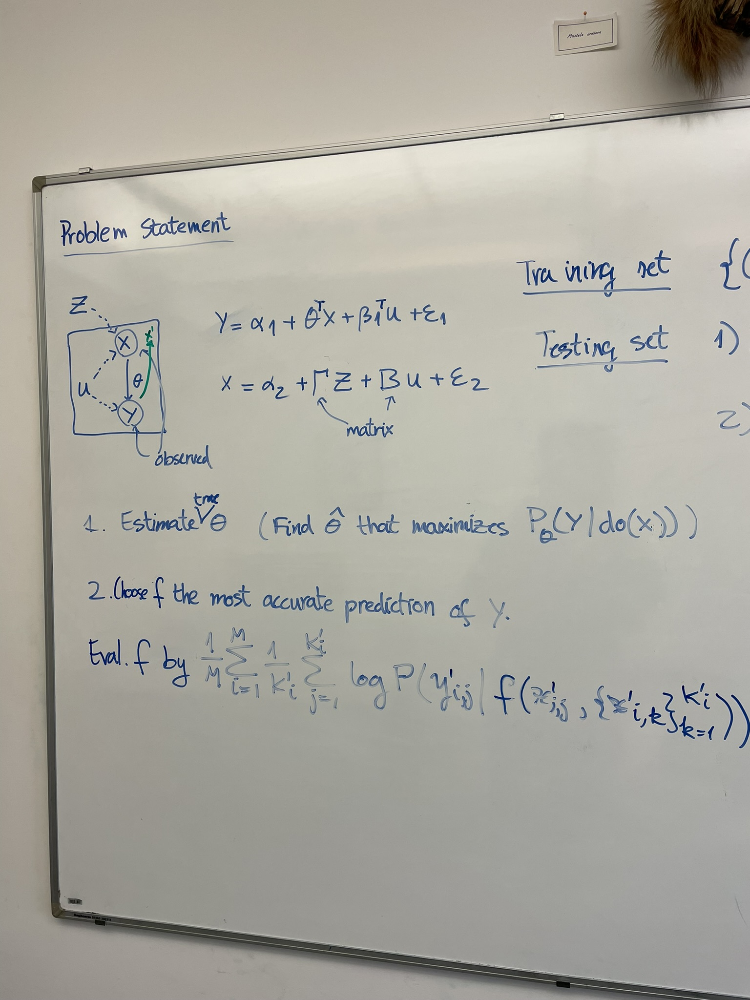
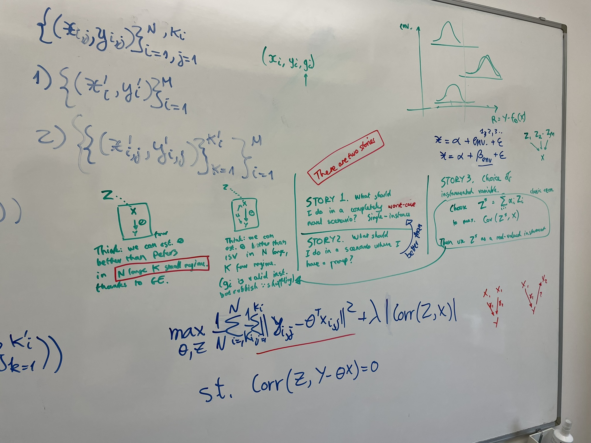

# March 2024

## Meeting Damon --- 2024-03-01

- Separate concerns: dataset and how we choose to conceive about the dataset.
- Notation that distinguishes between ground-truth generative models and trained generative models.
- Unclear what the problem is, where is the challenge. Give example of presence of conditional shift, and what effect that has, and absence of conditional shift. Extra 2 pages to really nail this.
- Explain the entirety, a synthesis, that helps separate between branch A and branch B. Give the reader understanding of the field.
- Why use an adversarial loss. Why use adversarial instead of VAE (KL term). Have other people run into this issue.

Machine Learning for Grouped Data

## Meeting Damon --- 2024-03-06

> This chapter is an illustration of how group-level latent variables can help with supervised learning in a causally challenging setting. Let's call it causal prediction. The goal is to get the best prediction of $Y$ given $X$.

### My description

We are in the ISV confounder setting. $Y = \alpha_1 + \theta^T X + \beta_1 U + \epsilon_1$ and $X = \alpha_2 + \gamma^T Z + \beta_2 U + \epsilon_2$.

1. Estimate the true $\theta$ (i.e., the one that maximises $P_\theta (Y | do(X))$).
2. Choose $f$ for the most accurate prediction of $Y$, so $P(Y_{i, j} | f(X_{i,j}, \{X_{i,k}\}_{k=1}^{K_i}))$ 

### Damon's description

| No confounder                                                                                                                                | Confounder                                                                                                                                                                                                         |
| -------------------------------------------------------------------------------------------------------------------------------------------- | ------------------------------------------------------------------------------------------------------------------------------------------------------------------------------------------------------------------ |
| No confounder, $X$ is both cause and effect of $Y$ (Peters). We can estimate $\theta$ better than Peters when $N$ is large and $K$ is small. | Confounder, $X$ is only cause of $Y$ (ISV). We can estimate $\theta$ better than ISV when $N$ large, $K$ small. (The index of the group is a valid instrumental variable, just a rubbish one because of shuffling) |

There are 3 stories:

1. What should I do in a completely novel scenario? I have a single instance of test data. This means that the instance could be very unfriendly, even adversarial. My best bet here is to use the true causal parameter $\theta$. GI can estimate $\theta$ more precisely when $N$ large, $K$ small.
2. What should I do in a scenario where I have a test-time group? I want to show that this works better than scenario 1. Basically GI can do better than $\theta$.
3. What should I do when I have choice of instrumental variables? Choose $Z' = \sum_{i=1}^K \alpha_i Z_i$ to maximise $\mathrm{Cov} (Z', X)$, then us it as a real-valued instrument. This is interesting, but outside the scope of this research.

> A question remains: What would ISV do in the absence of an instrument?

## Supervised learning, confounding, interventional data --- 2024-03-22

|                                 | Confounder is the same in the group                                  | Confounder is independent of group                                |
| ------------------------------- | -------------------------------------------------------------------- | ----------------------------------------------------------------- |
| Single observation at test-time | Causal inference by using instance variable as instrumental variable | Causal inference by using group variable as instrumental variable |
| Whole group at test-time        | Supervised learning with group variable as input                     | Supervised learning with instance variable as input               |

## Damon's thoughts about the third chapter

From a quick skim, it looks like your chapter is very heavy on the "Here is some maths that I'm laying down" front. I'm obviously not going to complain about a maths-heavy presentation. However, I think it's missing a trick ... I see your work as a way to shed light on the Domain Shift / Catastrophic Forgetting debate. 

> You can write expansively about what some Domain Shift people think, and why they're wrong, and present your "group-instance entanglement" as a thought experiment to make clear the circumstances under which they are wrong.

The Domain-Shift people think 

The econometricians and epidemiologists think that the causal parameter is the best predictor you can get. I say that you can get a better predictor if you use the group information.

> You don't need any heavy maths setup for this. Then you can go on to a simple application of group-inference combined with instrumental variables, as a way to say "Look, here's a dirt-simple application of my framework, which nonetheless gives some new and interesting results."

If I were writing this chapter, I'd write it in the style of "I've reached the top of the mountain, now I can relax and clock up some easy wins, and shower some benefits of clear thinking on the confused
masses below me". I wouldn't write it in the style of "I am an earnest young researcher pushing out yet another load of highly technical formulation and calculation".