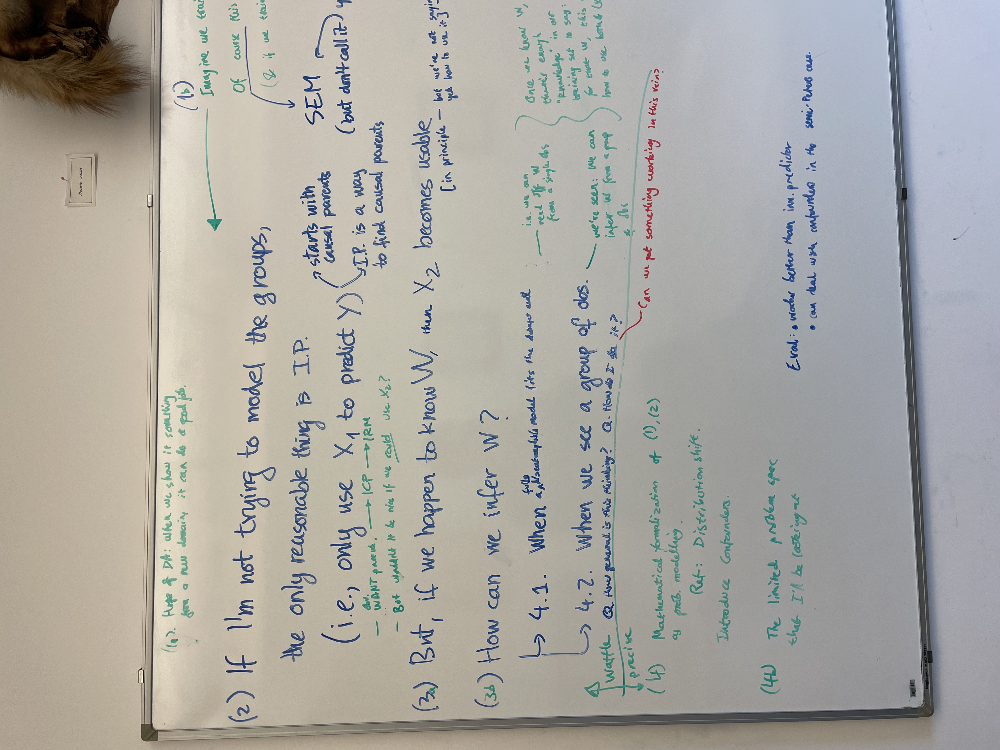
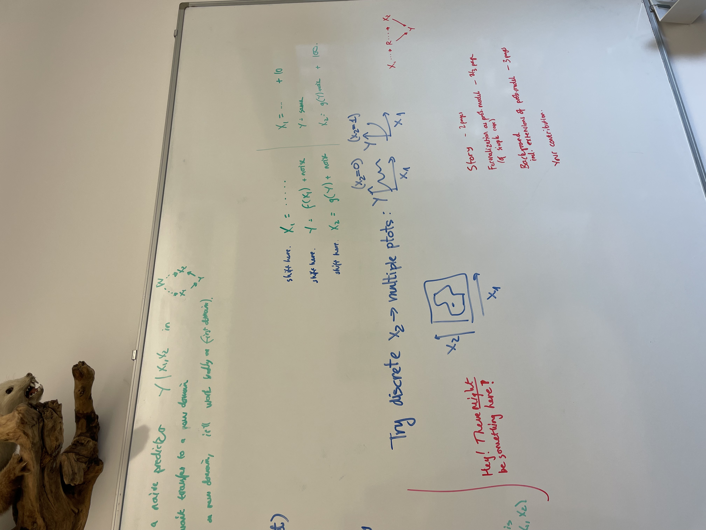
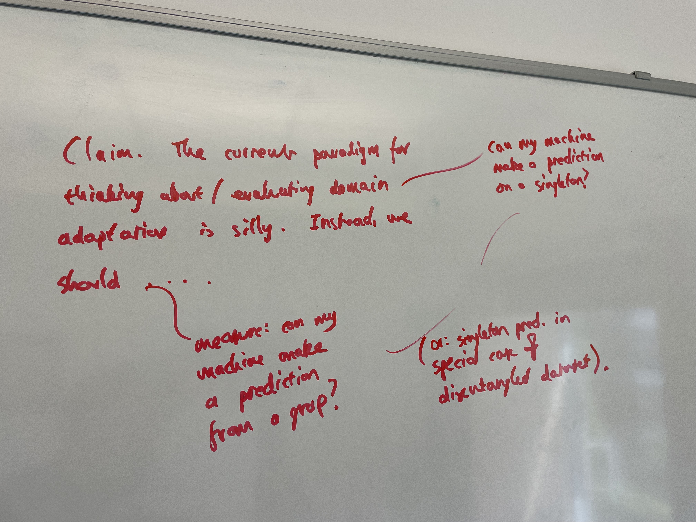
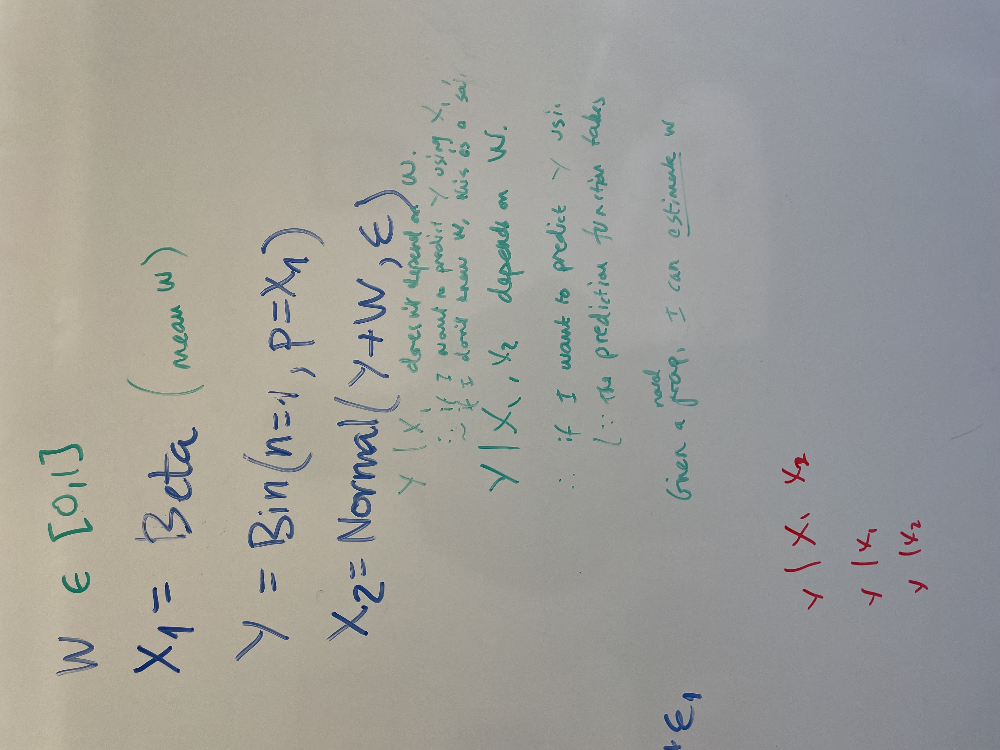
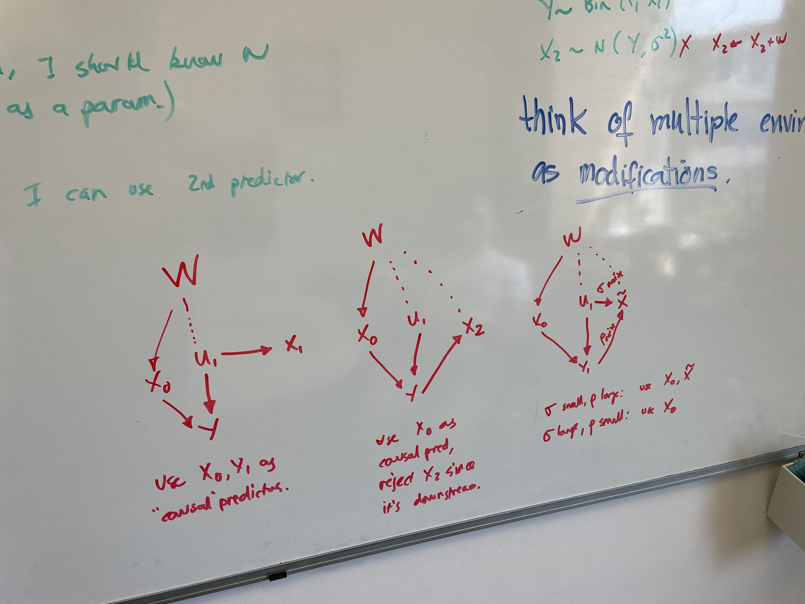

# June 2024

## Meeting with Damon - 2024-06-06

Unsupervised Domain Adaptation chapter

1. Story - 2 pages
   1. The hope of domain adaptation is when we show it something from a new domain, can it do a new job?
   2. Imagine that we train a naive predictor $Y | X_1, X_2$ in the model $(Y, W) \to X_2$ and $X_1 \to Y$ and $W \to X_1$. 
      1. Of course, it doesn't transfer to a new domain. We show this through an SEM (but don't call it this) and with simple calculations.
      2. And if we train on a new domain, it will work badly on the first domain.
   3. If I'm only modelling the individual observations, the only reasonable thing is causal predictors. This means we only use $X_1$ to predict $Y$.
      1. Invariant residuals are a way of learning a causal predictor.
      2. But wouldn't it be nice if we could use $X_2$?
   4. But, if we happen to know $W$, then $X_2$ becomes usable (in principle, but we're not saying how)
      1. Show how to use the value of $W$ using algebra.
      2. Once we know $W$, there's enough knowledge in out training set to say: for that $W$, this is how to use both the Xs.
   5. How can we infer $W$?
      1. When a fully disentanglable model fits the dataset well. We can read off $W$ from a single observation.
      2. When we see a group of observations. We've seen we can infer $W$ from a group of observations
   6. Questions remain: How general is this thinking? How do I do it? Can we get something working in this vein?
2. Formalisation as probabilistic model of simple case.
3. Background including extensions of probabilistic models.
   1. Talk about distributional shifts.
   2. Introduce confounders.
4. My contribution.
   1. Evaluation: Works better than invariant predictions.
   2. Can deal with confounders in the semi-Peters case.

## Meeting with Damon - 2024-06-07

Claim of the domain adaptation chapter: 
1. The current paradigm for thinking about / evaluating domain adaptation (can my model make predictions from a single observation?) is silly.
2. Instead, we should evaluate on groups: Can my model make predictions from multiple observations from the same domain?
3. Except for the special case of disentangled datasets.

The SCM is:

- $W \in [0,1]$
- $X_1 = \mathrm{Beta}(\mathrm{mean} ~ W)$
- $Y = \mathrm{Bin} (n=1, p=X_1)$
- $X_2 = \mathrm{Normal} (Y+W, \sigma^2)$

Points to make in the story:

- $Y | X_1$ does not depend on $W$. If I don't know $W$, this is safe.
- $Y | X_1, X_2$ depends on $W$. If I want to predict $Y$ using $X_2$, I need to take into account $W$.
- Given a novel group, I can estimate $W$.

Think of multiple environments as modifications.

## Meeting with Damon - 2024-06-26

- The task is to.
- My task is more interesting. My paradigm is an equally good reflection of the real-world task. But it also allows for better solutions to the real-world task.
- How to diagnose the dataset is disentangled? If yes, then use singleton prediction.
- Give an evaluation formula for singleton prediction.
- Why do we need multiple observations? First talk about discrete environments. Then talk about fuzzy
- There can be many examples of algorithms exploiting contextual predictions, I'm just considering one of them.
- Make clear how group-instance uses x1 and x2 separately, make clear that the group-instance model is building upon the. The de-environmentalised variables.
- Why use simple linear models? This is what a clinical researcher would do. I'm doing this with the ML level of a medic.

- SHow derivations of maths
- Explain transformers